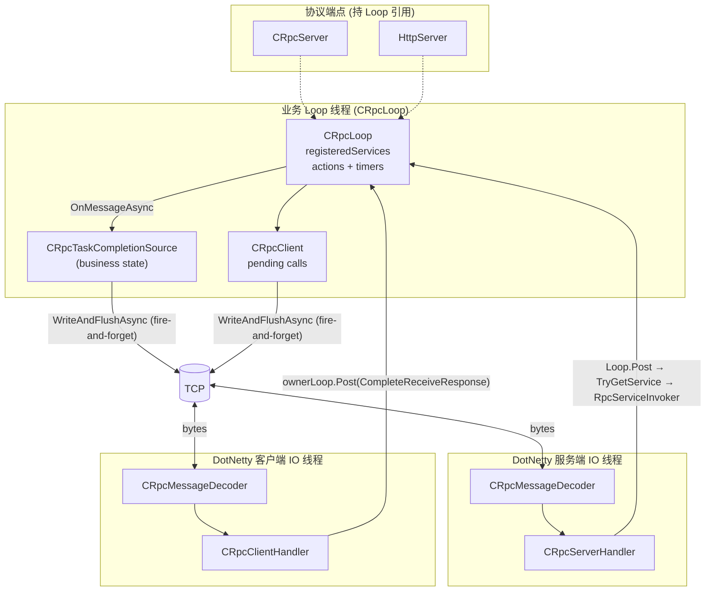
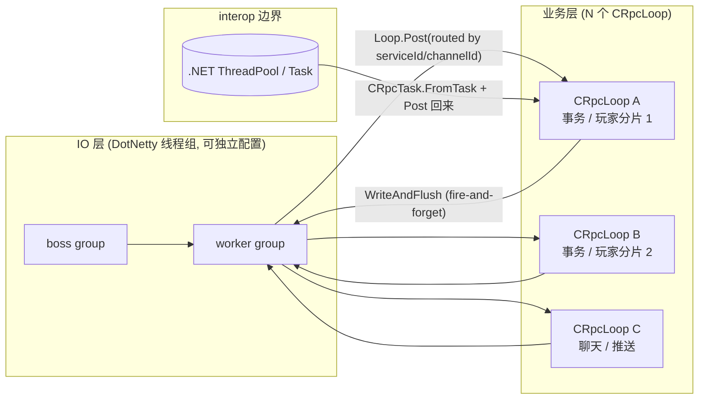

# CRpc 架构

> **范围**：线程、`CRpcLoop`、`CRpcServer` / `CRpcServerHandler`、`CRpcClient` / `CRpcClientHandler` 及其关系。既写现状，也标目标方向；**现有代码 ≠ 推荐设计**。

## 概要

目标模型与现状差异的浓缩说明；正文各章展开细节与代码对照。

### 执行单元：`CRpcLoop`

| 维度 | 说明 |
| --- | --- |
| 数量 | 进程内可有一个或多个 `CRpcLoop` |
| 线程 | 一个 loop 绑定一个业务线程；业务状态、注册表、pending 调用、定时器、`CRpcTask` 完成**只在该线程访问** |
| 角色 | **业务执行上下文**；不另设 Runtime 层 |
| 注册表 | `CRpcLoop.RegisterService` / `TryGetService`（内联 `Dictionary`，非独立 `ServiceRegistry` 类型） |
| 端点 | **CRpc 在核心**；HTTP 由应用层实现（见 `Example/HelloWorld/Server/Http/`），可选 Port Unification 与 CRpc 共端口；多 loop 路由仍缺 |
| 调度 | MPSC mailbox + loop-owned timer + `WaitForWorkOrTimer`；见 [§9.5](#95-crpcloop-调度timer-与-rpc-timeout) |

### 现状 vs 目标

| 维度 | 现状（代码） | 仍为方向 |
| --- | --- | --- |
| Service 归属 | `CRpcLoop` 持有注册表；`CRpcServer` / `HttpServer` 只持 `Loop`，经 `RpcServiceInvoker` 查 service | 独立 `ServiceRegistry` 类型；端点停止时不隐式清空 loop 注册表 |
| 端点与 loop | 多端点共享一 loop 已可用（CRpc 7999 + HTTP 8080）；`CRpcLoopHost` 统一驱动 | 按 serviceId / channel 路由到多个 loop；IO 线程组可注入（现仍硬编码 1+1） |
| Loop 驱动 | `Tick + WaitForWorkOrTimer`（服务端 `CRpcLoopHost` → `CRpcServerLoop`；客户端 `CRpcClientLoopHost` → `CRpcClientLoop`；一次性场景 `CRpcLoopRunner.RunUntilComplete`） | — |
| Runtime | — | 不引入单独 Runtime；Loop 即上下文 |

### 网络层：入口与适配，非 Service Owner

- **`CRpcServer`**：监听、pipeline、连接生命周期；把解码后的请求**投递**到目标 loop。
- **`CRpcServerHandler`**：DotNetty IO 线程上的搬运工；`ChannelRead` → 选 loop → `Post`。
- 二者是**网络入口与协议适配**，不是 Service 或业务状态的长期 owner。

### Service 间通信：按边界选型

```
同 loop / 同线程     →  直接本地接口调用（不经 RPC 序列化）
同进程 / 不同 loop   →  CRpcLoop.Post 到目标 loop；结果再 Post 回调用方 loop
不同进程             →  CRpcClient（或 Reference 代理）走真实 RPC
```

**选型**：能本地就不 RPC；跨线程必须 `Post`；跨进程才走 Client。

## 文档导读

| 篇章 | 章节 | 内容 |
| --- | --- | --- |
| [第一部分 · 原则与模型](#第一部分--原则与模型) | [§1](#1-设计目标与不变量)–[§4](#4-关系总览) | 不变量、组件、线程、拓扑与边界 |
| [第二部分 · Service 通信](#第二部分--service-通信) | [§5](#5-service-间通信模型) | 同线程 / 跨 loop / 跨进程选型与示例 |
| [第三部分 · 实现剖析](#第三部分--实现剖析) | [§6](#6-关键类的职责切片)–[§7](#7-完整请求生命周期) | 关键类代码切片、请求时序 |
| [第四部分 · 现状、目标与演进](#第四部分--现状目标与演进) | §8–§10 | 问题清单、目标架构、重构顺序 |
| [附录 · 共享传输（TcpChannelHost）](#附录--共享传输tcpchannelhost) | — | `TcpChannelHost`、`IChannelPipelineFactory` |

---

## 第一部分 · 原则与模型

### 1. 设计目标

CRpc 想要的核心模型是 **单线程业务循环 + 异步状态机**：

- 业务状态、RPC 注册表、pending 调用、定时器、`CRpcTask` 完成回调，**只在所属 `CRpcLoop` 线程上访问**。
- 跨线程的唯一合法入口是 `CRpcLoop.Post(Action)`：把工作排到目标 loop 的队列里，由 loop 线程取出执行。
- DotNetty IO 线程不直接跑业务逻辑，**仅做编解码 + Post 到业务 loop**。
- 异步原语统一用 `CRpcTask` / `CRpcTask<T>`，**不要**在业务实现里直接用 `System.Threading.Tasks.Task`（除非显式 interop，且要 marshal 回 loop）。
- `CRpcTaskCompletionSource.TrySetResult/TrySetException/TrySetCanceled` **只能在所属 loop 线程上调用**。
- **推荐**一个业务 OS 线程只驱动一个 `CRpcLoop`；**Debug 构建**下 `BindToCurrentThread` 若在同一线程绑定第二个 loop 实例会抛 `InvalidOperationException`（Release 不检查）。

这些约束在 `CRpcTaskCompletionSource.EnsureLoopThread`、`CRpcLoop.EnsureLoopThread` 中是强制的：

```86:92:CRpc/Async/CRpcTaskCompletionSource.cs
    private void EnsureLoopThread()
    {
        if (!loop.IsInLoopThread)
        {
            throw new InvalidOperationException("CRpcTaskCompletionSource must be used from its CRpcLoop loop thread.");
        }
    }
```

---

### 2. 组件清单

| 角色 | 类型 | 职责 |
| --- | --- | --- |
| 业务循环 | `CRpcLoop` | 单线程 **MPSC mailbox** + **loop-owned timer** + **service 注册表**；`Tick()` drain 动作与到期 timer；`WaitForWorkOrTimer` 阻塞等待（见 [§9.5](#95-crpcloop-调度timer-与-rpc-timeout)）。 |
| 循环驱动（一次性） | `CRpcLoopRunner` | 给主线程 / 同步入口用：`Tick + WaitForWorkOrTimer` 直到一个 `CRpcTask` 完成。 |
| 循环驱动（常驻） | `CRpcLoopHost` / `CRpcServerLoop` | 服务端常驻：`Tick + WaitForWorkOrTimer` 直到 cancel；推荐入口为 `CRpcLoopHost.RunUntilCancelled`。 |
| RPC 异步原语 | `CRpcTask` / `CRpcTask<T>` / `CRpcTaskCompletionSource<T>` / `CRpcAsyncMethodBuilder*` | 自定义 await 状态机；continuation 通过 `loop.Post` 回到 loop 线程恢复。 |
| 服务端 | `CRpcServer` | 协议端点：持有 `Loop` 引用；`StartAsync`/`StopAsync` 返回 `CRpcTask`，在 owner loop 上管理 DotNetty 监听；不持有 service 注册表。 |
| HTTP 端点 | `HttpServer` | 与 `CRpcServer` 相同模式：生命周期在 owner loop 上，HTTP/JSON 入站后 `Post` 到 loop，经 `RpcServiceInvoker` 调 service。 |
| 入站 dispatch | `RpcServiceInvoker` | loop 线程上统一 CRpc/HTTP 的 `OnMessageAsync` 调用与响应构造。 |
| 服务端 IO 处理器 | `CRpcServerHandler` | DotNetty `ChannelHandlerAdapter`；`ChannelRead` → `server.Loop.Post` → `TryGetService`。不持有业务状态。 |
| 客户端 | `CRpcClient` | 持有 `pending calls` 表 + DotNetty `Bootstrap`；`CallAsync` 要求显式正数 `timeout` 并在 **owner loop timer** 上注册；连接关闭时 `FailPendingCalls`；response/timeout/断连竞争语义见 [§9.5.8](#958-rpc-timeout-语义) / [§9.5.9](#959-pending-call-生命周期)。 |
| 客户端 IO 处理器 | `CRpcClientHandler` | DotNetty `ChannelHandlerAdapter`；`ChannelRead` → `OnReceiveResponse` → `Post` 回 owner loop；`ChannelInactive` → `OnChannelInactive` → `Post` 回 owner loop 清理 pending。 |
| 传输 | DotNetty `MultithreadEventLoopGroup` | boss/worker IO 线程；编解码 `CRpcMessageDecoder` / `CRpcMessage.toFrame`。 |
| 共享 TCP 宿主 | `TcpChannelHost` | 客户端侧 DotNetty Bootstrap + 单连接 lifecycle；`LoopInboundHandler` 将入站 `Post` 到 owner `CRpcLoop`；可选注入共享 `IEventLoopGroup`（见 [§8.1](#81-io-线程组与业务-loop-的拓扑)）。 |
| 管道工厂 | `IChannelPipelineFactory` | 按协议装配 pipeline（如 `CRpcClientPipelineFactory`）。 |

---

### 3. 线程角色

进程里同时存在的线程类别（按用途分）：

1. **业务 loop 线程**
   - 由谁创建：服务端来自 `CRpcLoopHost.RunUntilCancelled` 调用线程（推荐，见 `Example/HelloWorld/Server/Program.cs`）；客户端来自 `CRpcLoopRunner.RunUntilComplete` 的调用线程。
   - 谁绑定：`CRpcLoop.BindToCurrentThread()`，写入 `threadId` 与 `[ThreadStatic] current`。
   - 跑什么：`CRpcLoop.Tick()`，即注册服务、`OnMessageAsync`、`CallAsync`、超时回调、`CRpcTask` 的 continuation。

2. **DotNetty 服务端 boss 线程组**（`group`）
   - `CRpcServer.RunAsync` 里 `new MultithreadEventLoopGroup(1)`，处理 `accept`。

3. **DotNetty 服务端 worker 线程组**（`workGroup`）
   - 同上 `new MultithreadEventLoopGroup(1)`，处理已建立连接的读写、解码、`CRpcServerHandler.ChannelRead`。

4. **DotNetty 客户端 IO 线程组**
   - `CRpcClient` 里 `new MultithreadEventLoopGroup(1)`，处理 connect/read/write 与 `CRpcClientHandler.ChannelRead`。

5. **.NET 线程池 / 调用方任意线程**
   - `CRpcTask.FromTask` 用 `Task.ContinueWith` 做 interop，`ContinueWith` 的回调可能在线程池或同步线程上跑，**只允许 `loop.Post` 回业务 loop**，不能直接动业务状态。

---

### 4. 关系总览



关键边：

- **Netty IO 线程 → 业务 Loop**：唯一通道是 `CRpcLoop.Post`（`Server.Loop.Post` / `Client.ownerLoop.Post`）。
- **业务 Loop → Netty IO 线程**：调用 `IChannel.WriteAndFlushAsync(frame)`，**不 await 返回的 `Task`**（避免业务线程被 IO 写完成回调拖回线程池）。
- **业务 Loop 内部**：`CRpcTask` await ↔ `CRpcTaskCompletionSource.OnCompleted/TrySetResult` ↔ `loop.Post(continuation)`。

#### 4.1 Loop / Server / Handler 的边界

目标模型不引入单独的 `Runtime`。边界按"执行上下文、协议端点、IO 适配器"拆开：

- `CRpcLoop` 是 **业务执行上下文**：拥有业务线程、mailbox、timer、`CRpcTask` continuation，以及 service 注册表（`RegisterService` / `TryGetService`）。
- `IRpcService` 是 **业务能力和业务状态**：业务状态只在所属 `CRpcLoop` 线程访问。
- `CRpcServer` 是 **协议端点**：监听端口、配置 DotNetty pipeline、管理连接生命周期，并把解码后的请求投递到目标 loop。
- `CRpcServerHandler` 是 **IO 适配器**：运行在 DotNetty IO 线程，负责从 channel 取出消息、选择目标 loop、`Post`，以及把 loop 线程产生的响应写回 channel。

也就是说：

```text
CRpcLoop 决定：业务在哪里执行，Service 注册在哪里，状态归谁所有。
CRpcServer 决定：请求从哪个端口 / 哪种协议进入。
CRpcServerHandler 决定：IO 线程收到一条消息后，如何传递给业务 loop。
```

#### 4.2 多端口、多协议

多端口不是多份业务状态，而是多个协议端点共享同一个业务 loop：

```text
CRpcLoop A
  ├── registeredServices (RegisterService / TryGetService)
  │   ├── UserService
  │   └── OrderService
  ├── CRpcServer : 7999, CRpc 二进制协议
  └── HttpServer : 8080, HTTP/JSON 协议
```

多协议的关键是：不同端点把外部协议转换成统一的内部调用形态：

```text
serviceId + methodId + request body + IRpcContext
```

- CRpc 二进制端点：`TCP bytes -> CRpcMessage -> loop.Post -> RpcServiceInvoker -> CRpcMessage response -> TCP frame`。
- HTTP 端点：`HTTP/JSON -> serviceId/methodId/body -> loop.Post -> RpcServiceInvoker -> HTTP response`（参考 `HttpServerHandler`）。

---

## 第二部分 · Service 通信

### 5. Service 间通信模型

Service 之间如何通信，取决于双方是否在同一个 `CRpcLoop`、同一个进程、同一个线程。边界选型见文首 [概要 · Service 间通信](#service-间通信按边界选型)；本节给出原则、示例与代码。

总原则：

- **同线程**：直接本地接口调用。
- **同进程不同线程**：通过 `CRpcLoop.Post` 投递到目标 loop。
- **不同进程**：通过 `CRpcClient` 发起真正的 RPC 调用。
- **不要为了同进程本地协作绕一圈网络 RPC**。
- **不要跨线程直接访问另一个 Service 的业务状态**。

#### 5.1 同线程：直接本地接口调用

如果多个 Service 归属同一个 `CRpcLoop`，它们的业务逻辑都在同一个 loop 线程执行。注册在 loop 上（`loop.RegisterService`），CRpc/HTTP 等多个端点共享同一注册表。

这种情况下，Service 之间应当通过本地业务接口互相调用：

```csharp
var userImpl = new UserServiceImpl();
var orderImpl = new OrderServiceImpl(userImpl);
loop.RegisterService(userImpl);
loop.RegisterService(orderImpl);
// OrderServiceImpl.cs — 同 loop、同线程
public sealed class OrderServiceImpl : OrderBase
{
    private readonly UserServiceImpl users;
    public OrderServiceImpl(UserServiceImpl users) => this.users = users;
    protected override async CRpcTask<(int, CreateOrderReply)> CreateOrderAsync(
        CRpcContext context, CreateOrderRequest request)
    {
        var (code, user) = await users.GetUserAsync(context, new GetUserRequest { UserId = request.UserId });
        if (code != 0) return (code, new CreateOrderReply());
        // ...
    }
}
```

特点：

- 不需要锁。
- 不需要序列化。
- 不需要网络。
- 不经过 `IRpcService.OnMessageAsync`。
- 返回值继续使用 `CRpcTask<T>`，保持 loop 内异步模型一致。

`IRpcService.OnMessageAsync` 是外部 RPC 消息进入 Service 的传输层入口，不应作为同线程 Service 协作的主要接口。

#### 5.2 同进程不同线程：通过 `CRpcLoop.Post`

如果两个 Service 在同一个进程内，但分别归属不同的 `CRpcLoop`，就不能直接调用对方的业务方法。

每个 Service 的业务状态只属于自己的 owner loop。跨 loop 调用必须通过目标 loop 的 mailbox：

```csharp
targetLoop.Post(() =>
{
    targetService.DoSomething();
});
```

如果调用方需要返回值，流程应当是：

1. 调用方 loop 创建属于自己的 `CRpcTaskCompletionSource<T>`。
2. 调用方把请求 `Post` 到目标 loop。
3. 目标 loop 执行目标 Service 的业务逻辑。
4. 目标 loop 拿到结果后，再 `Post` 回调用方 loop。
5. 调用方 loop 上调用 `TrySetResult` / `TrySetException` 完成任务。

示意代码：

```csharp
public CRpcTask<UserInfo> GetUserFromOtherLoopAsync(long userId)
{
    var callerLoop = CRpcLoop.Current
        ?? throw new InvalidOperationException("Must run on a CRpcLoop thread.");

    var tcs = new CRpcTaskCompletionSource<UserInfo>(callerLoop);

    targetLoop.Post(() =>
    {
        var task = userService.GetUserAsync(userId);
        var awaiter = task.GetAwaiter();
        if (awaiter.IsCompleted)
        {
            CompleteUserCall(callerLoop, tcs, awaiter);
            return;
        }

        awaiter.OnCompleted(() => CompleteUserCall(callerLoop, tcs, awaiter));
    });

    return tcs.Task;
}

private static void CompleteUserCall(
    CRpcLoop callerLoop,
    CRpcTaskCompletionSource<UserInfo> tcs,
    CRpcTask<UserInfo>.Awaiter awaiter)
{
    try
    {
        var user = awaiter.GetResult();
        callerLoop.Post(() => tcs.TrySetResult(user));
    }
    catch (Exception ex)
    {
        callerLoop.Post(() => tcs.TrySetException(ex));
    }
}
```

这里最重要的线程安全规则是：

- `CRpcLoop.Post` 是跨线程入口，内部队列必须线程安全。
- 目标 Service 的业务状态只在目标 loop 线程访问。
- 调用方的 `CRpcTaskCompletionSource` 只在调用方 loop 线程完成。
- 跨线程传递的数据应当是不可变对象、DTO、值类型，或者明确 copy 出来的快照。
- 不要把可变业务对象同时暴露给两个 loop。

也就是说，同进程不同线程的通信模型不是“共享对象 + 加锁”，而是 **消息投递 + 线程所有权**。

#### 5.3 不同进程：真正的 RPC 调用

如果两个 Service 位于不同进程，就必须走 RPC：

```csharp
var response = await client.CallAsync(serviceId, methodId, body, timeout);
```

生成的 client stub 可以进一步封装协议细节：

```csharp
var (code, reply) = await greeterClient.SayHelloAsync(request);
```

特点：

- 需要序列化 / 反序列化。
- 需要网络传输。
- 需要 pending call 表。
- 需要超时、错误码、连接异常处理。
- 双方不共享内存。
- Service 只通过协议定义暴露能力。

#### 5.4 选择规则

- 同 loop / 同线程：本地接口直接调用，不需要序列化，也不跨线程。
- 同进程 / 不同 loop：`CRpcLoop.Post` 投递消息，通常不需要序列化，但建议只传 DTO / 快照。
- 不同进程：`CRpcClient` RPC 调用，需要序列化，也需要网络错误与超时处理。

一句话总结：

**能本地调用就不要 RPC；跨线程必须 `Post`；跨进程才走 `CRpcClient`。**

---

## 第三部分 · 实现剖析

### 6. 关键类的职责切片

#### 6.1 CRpcLoop

```6:108:CRpc/Async/CRpcLoop.cs
public sealed class CRpcLoop
{
    private readonly ConcurrentQueue<Action> actions = new();
    private readonly ICRpcLoopTimerScheduler timerScheduler;
    private readonly Dictionary<ushort, IRpcService> registeredServices = new(InitialServiceCapacity);
    private readonly ManualResetEventSlim wakeup = new(initialState: false);
    // ...
    public void Post(Action action);
    public void RegisterService(IRpcService service);
    public bool TryGetService(ushort serviceId, out IRpcService service);
    public void Tick(int maxActions = 1024);
    public void WaitForWorkOrTimer(CancellationToken cancellationToken);
}
```

- `actions` 是 **跨线程入口的 MPSC mailbox**：
  - **Producer（多）**：DotNetty IO 线程、`.NET Task` interop 回调、其它外部线程，经 `Post` 入队。
  - **Consumer（单）**：owner loop 线程，仅在 `Tick()` → `DrainActions` 中 dequeue。
  - **现状实现**用 `ConcurrentQueue<Action>`（库类型为 MPMC）；语义上只使用 MPSC 子集，不允许第二个 consumer 并发 drain。
  - **演进**：若压测显示 `Post` 队列成热点，可替换为专用 MPSC 队列；`Post` / `Tick` 边界不变。
- `registeredServices` 是 **loop-local service 注册表**；`RegisterService` / `TryGetService` / `UnregisterService` 均 `EnsureLoopThread`。
- `timerScheduler` 是 **loop-owned timer**（默认 `MinHeapTimerScheduler`）；`ScheduleDelay` / `ScheduleAt` 只能在 owner loop 线程调用。
- `Tick(maxActions)`：**actions → due timers → actions**；见 [§9.5.4](#954-tick-顺序)。
- **异常隔离**：`DrainActions` / `RunExpiredTimers` 内 per-item try/catch，经 `UnhandledException` 上报；见 [§9.5.5](#955-tick-异常隔离)。
- `WaitForWorkOrTimer` + `wakeup`：`Post` 时 `Enqueue + Set`；driver 侧 `Reset → 检查 → Wait`；见 [§9.5.3](#953-wakeup-机制去掉-sleep1)。

#### 6.2 CRpcServer + CRpcServerHandler + RpcServiceInvoker

```13:28:CRpc/Rpc/CRpc/Server/CRpcServer.cs
public sealed class CRpcServer : IRpcServer
{
    // ...
    public CRpcServer(CRpcLoop loop, CRpcServerOptions? options = null)
    {
        ArgumentNullException.ThrowIfNull(loop);
        Loop = loop;
        this.options = options ?? new CRpcServerOptions();
    }

    public CRpcLoop Loop { get; }
```

- `Loop` 在构造时**必须显式传入**；`CRpcServer` **不**持有 service 注册表。
- **推荐启动形态**（HelloWorld）：在 `CRpcLoopRunner.RunUntilComplete` 中 `loop.RegisterService` → `await crpcServer.StartAsync` + `await httpServer.StartAsync`，再 `CRpcLoopHost.RunUntilCancelled` 常驻驱动，退出时回到 loop 内 `await StopAsync`。
- `StartAsync` / `StopAsync` 返回 `CRpcTask`，必须在 owner loop 线程调用；DotNetty `BindAsync` / `CloseAsync` / `ShutdownGracefullyAsync` 经 `CRpcTask.FromTask(..., Loop)` 回到 loop 后再修改端点状态。
- `RunAsync` 也返回 `CRpcTask`，内部完成启动后嵌入 `CRpcLoopHost.RunUntilCancelled`；它保留“退出时 `ClearRegisteredServices`”的 host-helper 语义。
- DotNetty 仍硬编码 `MultithreadEventLoopGroup(1)`（boss + worker 各 1）；见 [§8.1](#81-io-线程组与业务-loop-的拓扑)。

```18:30:CRpc/Rpc/CRpc/Server/CRpcServerHandler.cs
    public override void ChannelRead(IChannelHandlerContext ctx, object msg)
    {
        var message = (CRpcMessage)msg;
        var serviceId = message.getServiceId();
        server.Loop.Post(() =>
        {
            if (server.Loop.TryGetService(serviceId, out var rpcService))
            {
                ProcessMessage(rpcService, ctx, message);
            }
        });
        // ...
    }
```

`CRpcServerHandler` 是 IO→Loop 搬运工：IO 线程 `Post` 到 loop，在 loop 线程 `TryGetService`，再经 `RpcServiceInvoker` 调业务：

```49:62:CRpc/Rpc/CRpc/Server/CRpcServerHandler.cs
    private static async CRpcTask ProcessMessageAsync(IRpcService rpcService, IChannelHandlerContext ctx, object msg)
    {
        var rpcContext = new CRpcContext();
        var request = (CRpcMessage)msg;
        var (resultCode, bytes) = await RpcServiceInvoker.InvokeAsync(rpcService, rpcContext, request);
        var rsp = RpcServiceInvoker.BuildCrpcResponse(request, resultCode, bytes);
        rsp.encryptAndCompress(512, true, true);
        // ...
        _ = ctx.WriteAndFlushAsync(frame);
    }
```

`HttpServerHandler` 走同一路径：解析 HTTP/JSON 后在 loop 线程 `TryGetService` + `RpcServiceInvoker.InvokeAsync`，再写 HTTP 响应。

注意 `_ = ctx.WriteAndFlushAsync(frame);` 是有意丢弃返回的 `Task` —— 与 `orientdotnet-general.mdc` 里"正常 RPC 响应不要 await 写完成"一致。

#### 6.3 CRpcClient + TcpChannelHost

`CRpcClient` 已将 DotNetty Bootstrap / channel lifecycle 委托给 `TcpChannelHost`；RPC 语义（pending calls、seq、timeout）仍留在 `CRpcClient`。

```12:26:CRpc/Rpc/CRpc/Client/CRpcClient.cs
public sealed class CRpcClient : IRpcClient, IAsyncDisposable
{
    private readonly Dictionary<long, PendingCall> results = new();
    private readonly TcpChannelHost host;
    private long reqSequence;
    private readonly CRpcLoop ownerLoop;
    // ...
}
```

- `results` 是 pending 调用表，**只能在 `ownerLoop` 线程上访问**。
- 连接状态由 `TcpChannelHost` 持有；`ConnectAsync` / `CloseAsync` 在 owner loop 线程调用；DotNetty connect/close 经 `CRpcTask.FromTask` 回到 loop。
- 入站：`LoopInboundHandler` → `host.PostInboundMessage` → `ownerLoop.Post` → `CRpcClient` 注册的 `InboundMessageReceived` → `OnReceiveResponse`。
- `ownerLoop` 在构造时显式绑定；`ConnectAsync` / `CloseAsync` / `CallAsync` 均要求 `CRpcLoop.Current` 与 owner 为同一实例。
- `reqSequence` 用 `Interlocked.Increment` —— 对外是线程安全的，但目前实际只可能从 owner loop 调用。

连接与调用流程：

- `ConnectAsync` / `CloseAsync` / `CallAsync` 均要求 owner loop 线程。
- `CallAsync(..., timeout)` 要求 `timeout > 0`；`timeout <= 0` 抛 `ArgumentOutOfRangeException`。默认超时应由 Reference / 生成代理提供，不在 transport 层用 `0` 表示无限等待。
- `CloseAsync`：清空 `channel` → `FailPendingCalls(ConnectionClosedException)` → DotNetty `CloseAsync`。
- `FailPendingCalls`：快照 pending、清空 `results`、取消 timer、批量 `TrySetException`；**只在 owner loop 线程执行**。

`LoopInboundHandler` 在 IO 线程，只做 ingress；`CRpcClient` 在 loop 线程处理消息与断连：

响应与断连均 marshal 回 owner loop：

```157:173:CRpc/Rpc/CRpc/Client/CRpcClient.cs
    internal void OnReceiveResponse(CRpcMessage message)
    {
        ownerLoop.Post(() => CompleteReceiveResponse(message));
    }

    internal void OnChannelInactive(IChannel inactiveChannel)
    {
        ownerLoop.Post(() =>
        {
            if (ReferenceEquals(channel, inactiveChannel)) { channel = null; }
            FailPendingCalls(new ConnectionClosedException("CRpcClient channel became inactive."));
        });
    }
```

`CompleteReceiveResponse` / timeout 回调 / `FailPendingCalls` 三者竞争同一 `results` 表：`Remove(seq)` 成功者独占完成权，迟到 response 或重复 close 事件被忽略。

详细设计见 [docs/superpowers/specs/2026-05-24-crpc-client-pending-call-lifecycle-design.md](../docs/superpowers/specs/2026-05-24-crpc-client-pending-call-lifecycle-design.md)。

#### 6.4 CRpcLoopHost / CRpcServerLoop / CRpcClientLoop / CRpcLoopRunner

- **现状**：`Tick + WaitForWorkOrTimer`。
- `CRpcLoopHost.RunUntilCancelled(loop, ct)`：服务端推荐常驻驱动入口（内部转发 `CRpcServerLoop`）。
- `CRpcClientLoopHost.RunUntilCancelled(loop, ct)`：客户端推荐常驻驱动入口（内部转发 `CRpcClientLoop`）。
- `CRpcLoopRunner.RunUntilComplete(loop, op)`：在调用线程 binding loop，跑到指定 `CRpcTask` 完成；适合 main 线程一次性脚本（如 HelloWorld Client）。

---

### 7. 完整请求生命周期

#### 7.1 服务端：收到一条请求 → 写出一条响应

```mermaid
sequenceDiagram
    autonumber
    participant Net as Socket
    participant Dec as CRpcMessageDecoder<br/>(Netty IO 线程)
    participant SH as CRpcServerHandler<br/>(Netty IO 线程)
    participant Loop as CRpcLoop (业务线程)
    participant Svc as IRpcService 实现
    participant TCS as CRpcTaskCompletionSource

    Net->>Dec: bytes
    Dec->>SH: ChannelRead(CRpcMessage)
    SH->>Loop: Loop.Post(() => ProcessMessage)
    Note right of SH: IO 线程返回，开始下一帧解码
    Loop->>Loop: Tick() drain action
    Loop->>Loop: TryGetService + RpcServiceInvoker
    Loop->>Svc: OnMessageAsync(ctx, req)
    Svc->>TCS: 状态机里 await 各种 CRpcTask
    TCS-->>Svc: 完成时通过 loop.Post 让 await 恢复
    Svc-->>Loop: 返回 (resultCode, bytes)
    Loop->>Net: ctx.WriteAndFlushAsync(frame) (fire-and-forget)
```

#### 7.2 客户端：发起调用 → 收到响应

```mermaid
sequenceDiagram
    autonumber
    participant App as 调用方<br/>(业务 loop 线程)
    participant Cli as CRpcClient
    participant Loop as CRpcLoop
    participant Net as Socket
    participant Dec as CRpcMessageDecoder<br/>(Netty IO 线程)
    participant CH as CRpcClientHandler<br/>(Netty IO 线程)

    App->>Cli: CallAsync(srv, mth, body, timeout)
    Cli->>Loop: ScheduleDelay(timeout, 超时回调)
    Cli->>Net: WriteAndFlushAsync(frame) (fire-and-forget)
    Cli-->>App: CRpcTask<CRpcMessage>
    App->>Loop: await → OnCompleted(continuation)

    Net->>Dec: bytes
    Dec->>CH: ChannelRead(CRpcMessage)
    CH->>Cli: client.OnReceiveResponse(message)
    Cli->>Loop: ownerLoop.Post(CompleteReceiveResponse)
    Loop->>Cli: CompleteReceiveResponse 在 loop 线程
    Cli->>Cli: results.Remove(seq) + 取消 timeout timer
    Cli->>Loop: pendingCall.Source.TrySetResult(message)
    Loop-->>App: continuation 被 Post 回来恢复
```

> Response 经 IO 线程 `Post` 回 owner loop；与 timeout / 断连的竞争规则见 [§9.5.8 RPC Timeout 语义](#958-rpc-timeout-语义) 与 [§9.5.9 Pending Call 生命周期](#959-pending-call-生命周期)。

#### 7.3 客户端：连接关闭 → pending call 失败

```mermaid
sequenceDiagram
    autonumber
    participant IO as DotNetty IO 线程
    participant CH as CRpcClientHandler
    participant Cli as CRpcClient
    participant Loop as CRpcLoop (owner)
    participant App as 调用方

    alt 主动 CloseAsync
        App->>Cli: CloseAsync()
        Cli->>Cli: channel = null
        Cli->>Cli: FailPendingCalls(ConnectionClosedException)
        Cli->>IO: CloseAsync (fire-and-forget via FromTask)
    else 对端断开 ChannelInactive
        IO->>CH: ChannelInactive
        CH->>Cli: OnChannelInactive(channel)
        Cli->>Loop: ownerLoop.Post(cleanup)
        Loop->>Cli: channel = null (若同一实例)
        Loop->>Cli: FailPendingCalls(ConnectionClosedException)
    end
    Loop-->>App: pending CRpcTask TrySetException
```

---

## 第四部分 · 现状、目标与演进

### 8. 现状中的设计问题（按严重程度）

> 这一节是"现有代码不一定是好的设计"的具体落点，便于后续重构。

#### 8.1 IO 线程组与业务 loop 的拓扑

**已部分落地（2026-05-30）**

- `TcpChannelHost` 支持可选 `sharedEventLoopGroup`：borrowed host 只关 channel，不 shutdown 共享 group；`CRpcClient` 已迁移到 `TcpChannelHost`（默认仍每 client 自有 group）。

**仍为现状 / 待做**

- `CRpcServer` / `HttpServer` 的 `StartAsync` 里仍硬编码 `MultithreadEventLoopGroup(1)`（boss + worker 各 1）；`CRpcServer.RunAsync` 同理。
- `CRpcClient` / `TcpChannelHost` 默认路径仍为每连接一个 group；`CRpcClientOptions` 注入共享 group 尚未暴露给业务 API。
- 业务 loop 线程来自 `CRpcLoopHost.RunUntilCancelled` 调用线程（推荐）或 `RunAsync` 内嵌驱动（遗留）。
- 后果：
  - 没有"按业务模块切多个 `CRpcLoop`"的路由能力，整个进程默认可视为单 loop 单线程业务吞吐。
  - 服务端仍无法配置 IO 线程数或复用同一 IO group 给多个 listener。
- 方向：
  - `CRpcServerOptions` / `CRpcClientOptions` 注入 `IEventLoopGroup`（options 类型已存在，CRPC 端注入仍待做）。
  - 服务端 handler 增加 `RouteLoop` 抽象，按 `serviceId` / channel 路由到不同 `CRpcLoop`。

#### 8.2 `CRpcServerHandler` 的 owner loop 选择不灵活

`ChannelRead` 里固定 `server.Loop.Post(...)` —— 一个 `CRpcServer` 实例只绑一个 loop。若需"按连接 / 按 serviceId / 按用户 ID 路由到不同 loop"，须改 handler 或增加路由抽象（例如在 `CRpcServer` 上加 `Func<CRpcMessage, CRpcLoop>? RouteLoop`）。`HttpServerHandler` 同样固定单 loop。

#### 8.3 `CRpcClient` 的 owner loop 绑定

- `pending calls` 表与 `channel` 连接状态均在 client 实例上，访问约定为 **owner loop 线程**（见 [§9.4 关键不变量](#94-关键不变量重申)）。
- 生命周期 API（`ConnectAsync` / `CloseAsync` / `ShutdownIoAsync`）已统一为 `CRpcTask`；DotNetty `.NET Task` 仅作 IO interop，completion 必须回到 owner loop。
- 推荐 teardown：`await reference.CloseAsync()` → `await reference.ShutdownIoAsync()`；`IAsyncDisposable.DisposeAsync` 保留兼容，但不适合在 loop 内 `await using` 等待异步 close。

#### 8.4 Server / HTTP endpoint 生命周期绑定

- `CRpcServer.StartAsync` / `StopAsync` 与 `HttpServer.StartAsync` / `StopAsync` 已统一为 `CRpcTask`，必须在 owner loop 线程调用。
- `bootstrapChannel`、IO groups、运行状态的写入收束到 owner loop；对外 `IsRunning` 是 `Volatile` 快照。
- `CRpcServer.RunAsync` 仅作为 host helper 保留；更明确的组合仍是 `StartAsync` + `CRpcLoopHost.RunUntilCancelled` + `StopAsync`。

#### 8.5 `CRpcLoopRunner.RunUntilComplete` 的使用方式

`HelloWorld/Client/Program.cs` 里（connect / call / close 均在 loop 内）：

```11:34:Example/HelloWorld/Client/Program.cs
CRpcLoopRunner.RunUntilComplete(loop, async () =>
{
    var reference = await CRpcReference
        .For<GreeterClient>()
        .Url("crpc://127.0.0.1:7999")
        .ConnectAsync(loop);

    try
    {
        var client = reference.Proxy;
        for (var i = 0; i < 5; i++)
        {
            var (result, helloReply) = await client.SayHelloAsync(req);
            Console.WriteLine($"call={i}, server return: result={result}, response: {helloReply.Msg}");
        }
    }
    finally
    {
        await reference.CloseAsync();
        await reference.ShutdownIoAsync();
    }
});
```

- 已提供 `CRpcReference` 与 `CRpcClientLoopHost`；`RunUntilComplete` 适合 main 线程一次性脚本，常驻客户端用 `CRpcClientLoopHost.RunUntilCancelled`。

#### 8.6 业务回调里 `Console.WriteLine` 当作可观测性

- `CRpcServerHandler` / `CRpcClientHandler` / `CRpcClient.__Send` 有大量 `Console.WriteLine($"*******…");`。
- 这是临时调试，**不是架构**。后续应该走 `Microsoft.Extensions.Logging` 之类的抽象，并能区分 IO 线程 / loop 线程的来源。

---

### 9. 目标架构（建议方向，不是当前实现）

#### 9.1 线程模型分层



- 多个业务 loop **互不共享状态**，靠消息传递。
- 每个 loop 拥有自己的 service 注册表；Service 不再长期归属于某个 Server。
- IO 层通过路由把请求 dispatch 到合适的 loop（最常见：按连接 ID / 用户 ID hash）。
- 多端口 / 多协议通过多个协议端点实现，这些端点可以共享同一个 loop，也可以按路由投递到不同 loop。
- 任何 `.NET Task` interop 必须 `Post` 回某个具体的 loop。

#### 9.2 推荐的 API 形态（草稿）

```csharp
// CRpcLoop: 可唤醒 mailbox + loop-owned timer + loop-local service registry
public sealed class CRpcLoop {
    public void Post(Action action);                          // enqueue + wake
    public CRpcLoopTimer ScheduleDelay(int ms, Action a);     // loop-thread only; 内部转 absolute due
    public CRpcLoopTimer ScheduleAt(long dueTimestamp, Action a); // 可选；deadline / 全链路预算
    public void RegisterService(IRpcService service);
    public bool TryGetService(ushort serviceId, out IRpcService service);
    public void UnregisterService(IRpcService service);
    public void Tick(int maxActions = 1024);                  // actions → due timers → actions
    public void WaitForWorkOrTimer(CancellationToken ct);     // 阻塞等待；由 loop 封装 Reset/Wait，防丢唤醒
}

// 驱动方（示意）
while (!ct.IsCancellationRequested) {
    loop.Tick();
    loop.WaitForWorkOrTimer(ct);   // scheduler 决定最多睡多久；完全空闲可无限等；无 Sleep(1)
}

// 驱动方
public static class CRpcLoopHost {
    public static void RunUntilCancelled(CRpcLoop loop, CancellationToken ct);
    public static T RunUntilComplete<T>(CRpcLoop loop, Func<CRpcTask<T>> op);
}

// Server / Client 显式注入 loop
public sealed class CRpcServer {
    public CRpcServer(CRpcLoop loop, CRpcServerOptions opts); // 不再默认 Main
    public CRpcTask StartAsync(CancellationToken ct = default);
    public CRpcTask StopAsync();
    public CRpcTask RunAsync(IPAddress address, int port, bool registerConsoleCancelHandler = true);
    public Func<CRpcMessage, CRpcLoop>? RouteLoop;            // 可选：按消息路由到不同 loop
}

// 其它协议端点同样只负责协议适配，然后投递到 loop
public sealed class HttpServer {
    public HttpServer(CRpcLoop loop, HttpServerOptions opts);
    public CRpcTask StartAsync(CancellationToken ct = default);
    public CRpcTask StopAsync();
}
public sealed class CRpcClient {
    public CRpcClient(CRpcLoop loop, CRpcClientOptions opts); // 显式 loop
}
```

#### 9.3 Client Reference API

业务代码不直接依赖 `CRpcClient.CallAsync(serviceId, methodId, body, timeout)`。推荐通过 `CRpcReference` 获取生成代理：

```csharp
var loop = new CRpcLoop();

// 一次性脚本：RunUntilComplete
CRpcLoopRunner.RunUntilComplete(loop, async () =>
{
    var reference = await CRpcReference
        .For<GreeterClient>()
        .Url("crpc://127.0.0.1:7999")
        .ConnectAsync(loop);

    try
    {
        var greeter = reference.Proxy;
        var (code, reply) = await greeter.SayHelloAsync(req);
    }
    finally
    {
        await reference.CloseAsync();
        await reference.ShutdownIoAsync();
    }
});

// 常驻客户端：专用 loop 线程
CRpcClientLoopHost.RunUntilCancelled(loop, cancellationToken);
```

`CRpcReference` 是业务入口；`CRpcClient` 是底层 transport client，仍负责连接、pending call、request sequence、超时和响应分发。Service 内部调用其它进程时也使用生成代理，但不能创建或驱动新的 loop，必须复用当前 `CRpcLoop.Current`。

#### 9.4 关键不变量（重申）

1. 业务状态 / pending 调用表 / service 注册表 / **client `channel` 连接状态** / endpoint 生命周期状态，**只在所属 loop 线程访问**。
2. `TrySetResult / TrySetException / TrySetCanceled` **只在所属 loop 线程调用**。
3. IO 线程不调业务逻辑，只做协议解析、路由选择和 `Post`。
4. `WriteAndFlushAsync` 不 await 完成（除非要影响业务状态，那就 `Post` 回来）。
5. `Task.Run` / `System.Threading.Timer` / 线程池续延 在 CRpc 实现里**禁用**；只允许显式 interop 后 `Post` 回 loop。
6. **Timer 永远是 loop-owned**：`ScheduleDelay` / `ScheduleAt` 只能在 owner loop 线程调用；timer callback 只在 owner loop 线程执行；不做全局 timer 线程直接完成 RPC timeout。外部线程若要安排延迟逻辑，先 `loop.Post(...)` 进入 owner loop 再注册 timer。
7. **Endpoint 生命周期 CRpc 化**：`CRpcServer` / `HttpServer` 的 `StartAsync` / `StopAsync`，以及 `CRpcClient` 的 `ConnectAsync` / `CloseAsync` / `ShutdownIoAsync` 返回 `CRpcTask`；DotNetty `.NET Task` 只做 IO interop，状态变更 completion 回到 owner loop。

#### 9.5 CRpcLoop 调度、Timer 与 RPC Timeout

> 本节覆盖 CRpcLoop 调度、通用 timer 与 `CRpcClient` RPC timeout 的一致性语义。

##### 9.5.1 设计原则

| 原则 | 说明 |
| --- | --- |
| MPSC mailbox | `Post` 多 producer、单 consumer；现用 `ConcurrentQueue`，语义是 MPSC，不是 MPMC 并发 drain |
| Loop-owned | Timer 无论底层用 min-heap 还是 timing wheel，**永远归属当前 `CRpcLoop`**，只在 `Tick()` 里推进，不另开全局 timer 线程 |
| Absolute deadline | 内部统一按 **absolute due timestamp**（`Stopwatch.GetTimestamp()`）排序；`ScheduleDelay(ms)` 只是便捷封装 |
| Driver 薄 | `CRpcLoopHost` / `CRpcServerLoop` / `CRpcClientLoopHost` / `CRpcClientLoop` / `CRpcLoopRunner` 使用 `Tick + WaitForWorkOrTimer`；空闲时阻塞，有 `Post` 或 timer 到期时唤醒 |

##### 9.5.2 Mailbox：MPSC 语义

`CRpcLoop.Post` / `Tick` 之间的 mailbox **语义是 MPSC**，不是 MPMC：

| 角色 | 线程 | 操作 |
| --- | --- | --- |
| Producer | DotNetty IO、线程池 interop、任意 `Post` 调用方 | `Enqueue` |
| Consumer | **唯一** owner loop 线程 | `Tick()` 内 `DrainActions` |

**为什么现状仍用 `ConcurrentQueue`**

- BCL 现成、正确性成熟；对 MPSC 用法完全够用。
- 当前瓶颈更可能在单 loop 业务串行、序列化、IO，而非队列本身。
- 专用 MPSC 队列（无锁、单 consumer 优化）留作性能演进项，不阻塞第一版。

**不变量**

- 除 owner loop 线程外，**不得** dequeue / drain `actions`。
- `Post` 只负责入队 + wakeup；业务状态修改在 consumer 侧执行。
- 与 libuv 对照：`ConcurrentQueue` ≈ 用户侧队列，`wakeup.Set()` ≈ `uv_async_send()`。

**可选演进**

```csharp
// 边界稳定时可替换 backend，CRpcLoop 对外 API 不变
internal interface ICRpcLoopMailbox
{
    void Enqueue(Action action);
    bool TryDequeue(out Action? action);
    bool IsEmpty { get; }
}
```

默认 `ConcurrentQueueMailbox`；热点场景换 `MpscActionMailbox`。

##### 9.5.3 Wakeup 机制

Driver hot loop 为 **有事立刻醒、没事按下一次 timer 阻塞等待**。

推荐 `ManualResetEventSlim`（不用 `SemaphoreSlim` 计数：`Tick` 是 batch drain；`Post` hot path 无锁，只有 `Enqueue + Set`）。

```text
Post(action):
  actions.Enqueue(action)
  wakeup.Set()

WaitForWorkOrTimer(ct):
  wakeup.Reset()             // 清掉上一轮 Set，避免 Wait 立刻返回空转
  if actions 非空 || scheduler 已有 due timer:
    return
  timeout = scheduler.GetDelayUntilNextWakeup(now)
  wakeup.Wait(timeout, ct)
```

**防丢唤醒**：`Reset` 后必须重新检查 mailbox/timer；`Post` 在 `Reset` 之后要么被 queue 检查发现，要么通过 `Set()` 唤醒 `Wait`。driver 不得自行 `Reset/Wait`。


##### 9.5.4 Tick 顺序

```text
Tick(maxActions):
  1. drain actions（最多 maxActions）
  2. run due timers（可有 maxTimers 上限，防 timer 风暴）
  3. drain actions（最多 maxActions）   // timer 回调里的 TrySet* → continuation → Post 同轮推进
```

相对现状（timer-first）的调整目的：**已进入 mailbox 的 response 优先于本轮 due timeout**，避免 response 已 `Post` 却被 timeout 抢先完成。

##### 9.5.5 Tick 异常隔离

**问题（R4）**：早期 `Tick` 内直接执行 `action()` / timer 回调，任一业务异常会冒泡到 `Tick()` 外层；`CRpcServerLoop.RunUntilCancelled` 当时无 try/catch，server 业务线程可能因此直接退出。

**现状**：每个 posted action 与 timer 回调单独隔离，循环本身不因单个业务失败而终止。

| 路径 | 实现 |
| --- | --- |
| Posted action | `DrainActions`：每个 `action()` 独立 try/catch |
| Timer 回调 | `RunExpiredTimers`：每次 `RunDueTimers(..., maxTimers: 1)` 独立 try/catch |
| 上报 | 捕获后调用 `HandleUnhandledException` → 触发 `UnhandledException` 事件 |
| 无订阅者 | 写 `Console.Error`，循环继续 |
| Handler 自身抛异常 | 二次 catch，写 `Console.Error`，循环继续 |

```csharp
/// Raised on the loop thread when an action or timer callback throws.
public event Action<Exception>? UnhandledException;
```

订阅方在 loop 线程收到异常，可用于日志、指标或告警；handler 内不应再抛未处理异常。

**Driver 兜底**：`CRpcServerLoop` / `CRpcClientLoop` / `CRpcLoopRunner` 在 `loop.Tick()` 外另有 try/catch，防止仍有异常逃出时终止 driver 线程（打 stderr 后继续循环）。

**行为保证**

- 单个 action / timer 失败不影响同 tick 内后续 work
- `Tick()` 本身不向调用方传播业务异常
- 有 / 无 `UnhandledException` 订阅者，循环均保持存活

**测试**：`Tests/CRPC.Tests/CRpcLoopExceptionIsolationTests.cs`（action / timer 连续执行、事件上报、无 handler、handler 自身抛异常）。

**后续可选**：生产 server 尚未统一订阅 `UnhandledException`，默认仅 stderr；若需集中日志 / 监控，可在 `CRpcServer` 启动处挂载 handler。

##### 9.5.6 Timer Scheduler 抽象

第一版只实现 min-heap，但接口先留好，便于以后按 loop 配置 backend。**Driver / `WaitForWorkOrTimer` 只依赖一个等待 timeout 入口**，不感知 backend 是 min-heap 还是 timing wheel：

```csharp
internal interface ICRpcLoopTimerScheduler
{
    CRpcLoopTimer ScheduleAt(long dueTimestamp, Action callback);
    int RunDueTimers(long now, int maxTimers);
    TimeSpan? GetDelayUntilNextWakeup(long now);   // WaitForWorkOrTimer 的唯一 timeout 来源
}
```

**`GetDelayUntilNextWakeup(now)` 与「绝对 deadline」的区别**

| 概念 | 含义 | 谁用 |
| --- | --- | --- |
| 绝对 deadline（`Stopwatch` ticks） | 下一个 timer **在哪个时间点** due | min-heap 堆顶、调试/指标；**不必放进通用 scheduler 接口** |
| `GetDelayUntilNextWakeup(now)` | 从 `now` 起，driver **最多还能睡多久** | `WaitForWorkOrTimer` 唯一依赖 |

二者相关但不等价：

- **Min-heap**：通常 `delay = nextDueTimestamp - now`；已 due 时返回 `TimeSpan.Zero`；无 timer 时返回 `null`（无限等）。
- **Timing wheel**：可能是下一格 tick、下一非空 slot 距 `now` 多久；**不一定**能用一个全局 `nextDueTimestamp` 表达（固定 tick 推进时更偏「下一唤醒点」而非精确堆顶 deadline）。

因此 **不在 `ICRpcLoopTimerScheduler` 上暴露 `GetNextDueTimestamp()`**，避免两个 API 表达同一件事、且 timing wheel 难以统一实现。若 min-heap 实现需要堆顶 deadline，作为 `MinHeapTimerScheduler` 内部字段即可。

| Backend | 状态 | 特点 | `GetDelayUntilNextWakeup` |
| --- | --- | --- | --- |
| `MinHeapTimerScheduler` | **第一版默认** | `PriorityQueue`，精确 deadline，类似 libuv | 堆顶 `due - now`；已 due → `Zero` |
| `TimingWheelTimerScheduler` | 预留 | loop-owned timing wheel，仅在 `Tick()` 推进、无额外线程 | 下一 tick 或下一非空 slot 距 `now` 多久 |

`CRpcLoopOptions` 可预留 `TimerSchedulerFactory`，默认 `() => new MinHeapTimerScheduler()`。Public API 不暴露 backend 细节，业务只调用 `ScheduleDelay` / `ScheduleAt`。

##### 9.5.7 换成 Timing Wheel 后

换 backend **不改变** driver 主循环形态，仍是 `Tick + WaitForWorkOrTimer`，只是 scheduler 内部从 min-heap 换成 timing wheel：

```text
Tick:
  drain actions
  timingWheel.RunDueTimers(now)   // 或 Advance(now) + 执行到期 slot
  drain actions

WaitForWorkOrTimer:
  if actions 非空: return
  if wheel 当前已有 due timer: return
  timeout = wheel.GetDelayUntilNextWakeup(now)
  wakeup.Wait(timeout, ct)
```

Timing wheel 常见两种推进方式（backend 内部选择，driver 不变）：

- **固定 tick 推进**：例如 wheel tick = 10ms，空闲时最多等到下一格；精度为 tick 粒度，适合海量 RPC timeout。
- **跳跃式推进**：中间空格直接等到下一非空 slot 的理论时间再推进多格；CPU 更省，实现更复杂。

无论哪种，原则不变：timing wheel 仍是 loop-owned、只在 `Tick()` 推进、timeout callback 在 owner loop 线程执行、`Post` 仍 `wakeup.Set()`。

##### 9.5.8 RPC Timeout 语义

**适用范围**

| 调用边界 | 是否使用 RPC timeout |
| --- | --- |
| 同线程 / 同 `CRpcLoop` 本地接口调用 | **否** — 普通本地调用，无 pending call 表、无 seq、无 IO `Post` |
| 不同进程 RPC（`CRpcClient.CallAsync`） | **是** — 必须传显式正数 `timeout`（毫秒），在 owner loop 注册 timer |
| 同进程不同 loop 异步投递（未来） | 可选 deadline；属于跨 loop 调用层，不污染同 loop 本地调用 |

**`CallAsync(..., timeout)` 流程**

1. 校验 `timeout > 0`；`timeout <= 0` 抛 `ArgumentOutOfRangeException`（transport 层不支持无限等待）。
2. 在 owner loop 线程创建 `PendingCall`，写入 `results` 表。
3. `due = now + timeout`，经 `ScheduleDelay` / scheduler 注册 timeout 回调。
4. IO 线程收到 response → `ownerLoop.Post(CompleteReceiveResponse)`，**不**在 IO 线程碰 pending 表。
5. `CompleteReceiveResponse`：`results.Remove(seq)` 成功则 `TimeoutTimer.Cancel()` + `TrySetResult`。
6. Timeout 回调：`results.Remove(seq)` 成功则 `TrySetException(TimeoutException)`。

**竞争规则（loop 内确定语义）**

- 若 response 已通过 `Post` 进入 mailbox，**同一轮 `Tick` 中 actions 先于 due timers 处理** → response 优先。
- 若 timeout 已生效并移除 pending，后续迟到的 response **`Remove` 失败，忽略**（不二次完成 TCS）。
- 不做"网络到达时刻"的严格 deadline；语义以 **loop 处理顺序** 为准，与单线程 owner 模型一致。

**默认 timeout 的分层**

- `CRpcClient.CallAsync`：调用方必须传正数 timeout。
- Reference / 生成代理：提供业务默认值（如 `SayHelloAsync(..., timeOut = 5000)`），不把 `0` 转发给 `CallAsync`。

**与 Dubbo / tRPC 的对照**

- Dubbo：对外配置 duration，内部 future + timer/wheel 按到期时间检查 —— 对应 `ScheduleDelay` + pending call timer。
- tRPC-Go：全链路 deadline / 剩余预算 —— 对应预留 `ScheduleAt(deadline)`，未来可在 Reference / Context 层透传剩余时间。

##### 9.5.9 Pending Call 生命周期

Pending call 与连接生命周期绑定。一条 in-flight RPC 只有三种完成路径：

| 完成方式 | 触发 | 结果 |
| --- | --- | --- |
| 成功 | 匹配 response 到达 | `TrySetResult(CRpcMessage)` |
| 超时 | owner loop timer 到期 | `TrySetException(TimeoutException)` |
| 连接关闭 | `CloseAsync` 或 `ChannelInactive` | `TrySetException(ConnectionClosedException)` |

**连接关闭清理**

- **主动**：`CloseAsync` 在 owner loop 线程清空 `channel`，调用 `FailPendingCalls`，再关闭 DotNetty channel。
- **被动**：`CRpcClientHandler.ChannelInactive`（IO 线程）→ `OnChannelInactive` → `ownerLoop.Post` → 若 `channel` 为同一实例则清空 → `FailPendingCalls`。
- `FailPendingCalls`：快照 `results`、清空字典、取消各 pending 的 timer、`TrySetException`。**禁止在 IO 线程直接操作 `results` 或 TCS。**

**与 timeout / response 的竞争**

- 三种完成路径均通过 `results.Remove(seq)` 竞争；先成功者独占，其余路径的迟到事件忽略。
- 连接关闭后迟到的 response 不会 resurrect 已失败的 pending call。

Spec：[2026-05-24-crpc-client-pending-call-lifecycle-design.md](../docs/superpowers/specs/2026-05-24-crpc-client-pending-call-lifecycle-design.md)

##### 9.5.10 Driver 主循环（现状）

```csharp
loop.BindToCurrentThread();
while (!cancellationToken.IsCancellationRequested)
{
    try
    {
        loop.Tick();
    }
    catch (Exception exception)
    {
        Console.Error.WriteLine($"CRpcServerLoop: unexpected exception escaped Tick: {exception}");
    }

    loop.WaitForWorkOrTimer(cancellationToken);
}
```

`CRpcClientLoop` / `CRpcLoopRunner` 同样在 `Tick()` 外 try/catch。业务异常正常在 `Tick` 内隔离（见 [§9.5.5](#955-tick-异常隔离)）；外层 catch 仅作兜底。

`CRpcLoopRunner.RunUntilComplete` 同理：`Tick + WaitForWorkOrTimer` 直到目标 `CRpcTask` 完成。

---

### 10. 现状到目标的演进步骤（建议顺序）

1. **`RouteLoop` 钩子**：`CRpcServer` / `HttpServer` 增加 `Func<..., CRpcLoop>? RouteLoop`，支持按消息路由到不同 loop（见 §9.2）。
2. **IO 线程可配置 / 可复用**：`TcpChannelHost` 已支持注入共享 group；`CRpcServerOptions` / `CRpcClientOptions` 对 CRPC 服务端与 Reference 客户端暴露注入仍待做。
3. **多端口 / 多协议示例变体**：HelloWorld 已演示同一 loop 上 CRpc 7999 + HTTP 8080；补充第二个 CRpc 端口、管理端口等变体示例。
4. **多 loop 真用起来**：示例工程加一个"按用户 ID hash 分两个业务 loop"的 demo，覆盖跨 loop 调用 / 路由 / 关闭顺序。
5. **替换 `Console.WriteLine`**：引入日志抽象，并标注 `[loop|io|tp]` 来源。
6. **清理 host helper 语义**：评估是否保留 `CRpcServer.RunAsync` 的“结束时隐式 `ClearRegisteredServices`”；常规端点生命周期使用 `CRpcTask StartAsync` + `CRpcLoopHost` + `CRpcTask StopAsync` 模式。

---

## 附录 · 共享传输（TcpChannelHost）

| 项 | 说明 |
| --- | --- |
| 位置 | `CRpc/Transport/TcpChannelHost.cs` |
| 职责 | 单 TCP 连接的 DotNetty Bootstrap、connect/write/close、可选 IO group 生命周期 |
| 入站 | `LoopInboundHandler` → `PostInboundMessage` / `PostChannelInactive` → `ownerLoop.Post` |
| 共享 group | 构造参数 `sharedEventLoopGroup`；`ownsEventLoopGroup == false` 时 dispose 不 shutdown group |
| 消费者 | `CRpcClient`（默认自有 group）；多连接场景可注入同一 `IEventLoopGroup`，由调用方负责单次 shutdown |

Pipeline 由 `IChannelPipelineFactory` 注入；不同 wire 协议各自实现 factory，共用 `TcpChannelHost` 连接生命周期。

---
