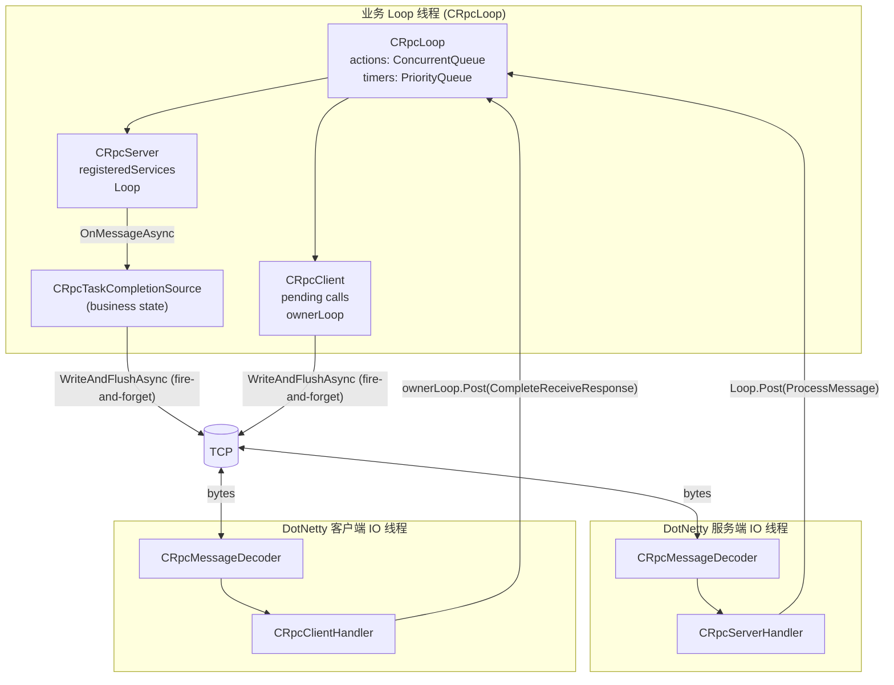
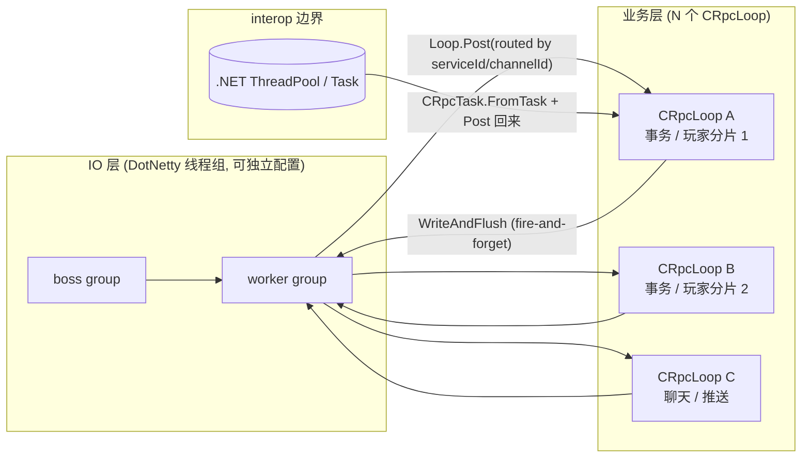

# CRpc 架构与线程模型

> **范围**：线程、`CRpcLoop`、`CRpcServer` / `CRpcServerHandler`、`CRpcClient` / `CRpcClientHandler` 及其关系。既写现状，也标目标方向；**现有代码 ≠ 推荐设计**。

## 概要

目标模型与现状差异的浓缩说明；正文各章展开细节与代码对照。

### 执行单元：`CRpcLoop`

| 维度 | 说明 |
| --- | --- |
| 数量 | 进程内可有一个或多个 `CRpcLoop` |
| 线程 | 一个 loop 绑定一个业务线程；业务状态、注册表、pending 调用、定时器、`CRpcTask` 完成**只在该线程访问** |
| 角色 | **业务执行上下文**；不另设 Runtime 层 |
| 注册表 | **目标**：`CRpcLoop` 持有 `ServiceRegistry` |
| 端点 | **目标**：同一 loop 可挂多个协议入口（多个 `CRpcServer`、HTTP、管理端口等） |

### 现状 vs 目标

| | 现状 | 目标 |
| --- | --- | --- |
| Service 归属 | `CRpcServer` 持有 `CRpcLoop` + `registeredServices` | `CRpcLoop` 持有 `ServiceRegistry`；Server 只做端点 |
| 端点与 loop | 常见为「一 Server 一 Loop」 | 多 Server / 多协议共享一 Loop |
| Runtime | — | 不引入单独 Runtime；Loop 即上下文 |

### 网络层：入口与适配，非 Service Owner

- **`CRpcServer`**：监听、pipeline、连接生命周期；把解码后的请求**投递**到目标 loop。
- **`CRpcServerHandler`**：DotNetty IO 线程上的搬运工；`ChannelRead` → 选 loop → `Post`。
- 二者是**网络入口与协议适配**，不是 Service 或业务状态的长期 owner。

### Service 间通信：按边界选型

```
同 loop / 同线程     →  直接本地接口调用（不经 RPC 序列化）
同进程 / 不同 loop   →  CRpcLoop.Post 到目标 loop；结果再 Post 回调用方 loop
不同进程             →  CRpcClient（或 Reference 代理）走真实 RPC
```

**选型**：能本地就不 RPC；跨线程必须 `Post`；跨进程才走 Client。

## 文档导读

| 篇章 | 章节 | 内容 |
| --- | --- | --- |
| [第一部分 · 原则与模型](#第一部分--原则与模型) | [§1](#1-设计目标与不变量)–[§4](#4-关系总览) | 不变量、组件、线程、拓扑与边界 |
| [第二部分 · Service 通信](#第二部分--service-通信) | [§5](#5-service-间通信模型) | 同线程 / 跨 loop / 跨进程选型与示例 |
| [第三部分 · 实现剖析](#第三部分--实现剖析) | [§6](#6-关键类的职责切片)–[§7](#7-完整请求生命周期) | 关键类代码切片、请求时序 |
| [第四部分 · 现状、目标与演进](#第四部分--现状目标与演进) | §8–§10 | 问题清单、目标架构、重构顺序 |

---

## 第一部分 · 原则与模型

### 1. 设计目标与不变量

CRpc 想要的核心模型是 **单线程业务循环 + 异步状态机**：

- 业务状态、RPC 注册表、pending 调用、定时器、`CRpcTask` 完成回调，**只在所属 `CRpcLoop` 线程上访问**。
- 跨线程的唯一合法入口是 `CRpcLoop.Post(Action)`：把工作排到目标 loop 的队列里，由 loop 线程取出执行。
- DotNetty IO 线程不直接跑业务逻辑，**仅做编解码 + Post 到业务 loop**。
- 异步原语统一用 `CRpcTask` / `CRpcTask<T>`，**不要**在业务实现里直接用 `System.Threading.Tasks.Task`（除非显式 interop，且要 marshal 回 loop）。
- `CRpcTaskCompletionSource.TrySetResult/TrySetException/TrySetCanceled` **只能在所属 loop 线程上调用**。
- **推荐**一个业务 OS 线程只驱动一个 `CRpcLoop`；**Debug 构建**下 `BindToCurrentThread` 若在同一线程绑定第二个 loop 实例会抛 `InvalidOperationException`（Release 不检查）。

这些约束在 `CRpcTaskCompletionSource.EnsureLoopThread`、`CRpcLoop.EnsureLoopThread` 中是强制的：

```86:92:CRpc/Async/CRpcTaskCompletionSource.cs
    private void EnsureLoopThread()
    {
        if (!loop.IsInLoopThread)
        {
            throw new InvalidOperationException("CRpcTaskCompletionSource must be used from its CRpcLoop loop thread.");
        }
    }
```

---

### 2. 组件清单

| 角色 | 类型 | 职责 |
| --- | --- | --- |
| 业务循环 | `CRpcLoop` | 单线程 mailbox：动作队列 + 定时器队列；`Tick()` 把到期定时器和待执行动作 drain 一遍。目标上也是 `ServiceRegistry` 的 owner。 |
| 循环驱动（一次性） | `CRpcLoopRunner` | 给主线程 / 同步入口用：`Tick + Sleep` 直到一个 `CRpcTask` 完成。 |
| 循环驱动（常驻） | `CRpcServerLoop` | 服务端常驻：`Tick + Sleep(1)` 直到 cancel。 |
| RPC 异步原语 | `CRpcTask` / `CRpcTask<T>` / `CRpcTaskCompletionSource<T>` / `CRpcAsyncMethodBuilder*` | 自定义 await 状态机；continuation 通过 `loop.Post` 回到 loop 线程恢复。 |
| 服务端 | `CRpcServer` | 当前持有 `Loop` + `registeredServices`；目标上退化为协议端点：监听端口、配置 pipeline、把 IO 收到的消息派发给业务 loop。 |
| 服务端 IO 处理器 | `CRpcServerHandler` | DotNetty `ChannelHandlerAdapter`；`ChannelRead` 时选择目标 loop 并 `Post`。不持有业务状态。 |
| 客户端 | `CRpcClient` | 持有 `pending calls` 表 + DotNetty `Bootstrap`；发起 `CallAsync`，超时由 loop timer 调度。 |
| 客户端 IO 处理器 | `CRpcClientHandler` | DotNetty `ChannelHandlerAdapter`；`ChannelRead` 把响应交给 `CRpcClient.OnReceiveResponse`，再 `Post` 回 owner loop。 |
| 传输 | DotNetty `MultithreadEventLoopGroup` | boss/worker IO 线程；编解码 `CRpcMessageDecoder` / `CRpcMessage.toFrame`。 |

---

### 3. 线程角色

进程里同时存在的线程类别（按用途分）：

1. **业务 loop 线程**
   - 由谁创建：服务端来自 `CRpcServerLoop.RunUntilCancelled` 调用线程（默认就是 `Program.Main` 跑 `RunAsync` 的线程）；客户端来自 `CRpcLoopRunner.RunUntilComplete` 的调用线程。
   - 谁绑定：`CRpcLoop.BindToCurrentThread()`，写入 `threadId` 与 `[ThreadStatic] current`。
   - 跑什么：`CRpcLoop.Tick()`，即注册服务、`OnMessageAsync`、`CallAsync`、超时回调、`CRpcTask` 的 continuation。

2. **DotNetty 服务端 boss 线程组**（`group`）
   - `CRpcServer.RunAsync` 里 `new MultithreadEventLoopGroup(1)`，处理 `accept`。

3. **DotNetty 服务端 worker 线程组**（`workGroup`）
   - 同上 `new MultithreadEventLoopGroup(1)`，处理已建立连接的读写、解码、`CRpcServerHandler.ChannelRead`。

4. **DotNetty 客户端 IO 线程组**
   - `CRpcClient` 里 `new MultithreadEventLoopGroup(1)`，处理 connect/read/write 与 `CRpcClientHandler.ChannelRead`。

5. **.NET 线程池 / 调用方任意线程**
   - `CRpcTask.FromTask` 用 `Task.ContinueWith` 做 interop，`ContinueWith` 的回调可能在线程池或同步线程上跑，**只允许 `loop.Post` 回业务 loop**，不能直接动业务状态。

---

### 4. 关系总览



关键边：

- **Netty IO 线程 → 业务 Loop**：唯一通道是 `CRpcLoop.Post`（`Server.Loop.Post` / `Client.ownerLoop.Post`）。
- **业务 Loop → Netty IO 线程**：调用 `IChannel.WriteAndFlushAsync(frame)`，**不 await 返回的 `Task`**（避免业务线程被 IO 写完成回调拖回线程池）。
- **业务 Loop 内部**：`CRpcTask` await ↔ `CRpcTaskCompletionSource.OnCompleted/TrySetResult` ↔ `loop.Post(continuation)`。

#### 4.1 Loop / Server / Handler 的边界

目标模型不引入单独的 `Runtime`。边界按"执行上下文、协议端点、IO 适配器"拆开：

- `CRpcLoop` 是 **业务执行上下文**：拥有业务线程、mailbox、timer、`CRpcTask` continuation，以及目标上的 `ServiceRegistry`。
- `IRpcService` 是 **业务能力和业务状态**：业务状态只在所属 `CRpcLoop` 线程访问。
- `CRpcServer` 是 **协议端点**：监听端口、配置 DotNetty pipeline、管理连接生命周期，并把解码后的请求投递到目标 loop。
- `CRpcServerHandler` 是 **IO 适配器**：运行在 DotNetty IO 线程，负责从 channel 取出消息、选择目标 loop、`Post`，以及把 loop 线程产生的响应写回 channel。

也就是说：

```text
CRpcLoop 决定：业务在哪里执行，Service 注册在哪里，状态归谁所有。
CRpcServer 决定：请求从哪个端口 / 哪种协议进入。
CRpcServerHandler 决定：IO 线程收到一条消息后，如何搬运到业务 loop。
```

#### 4.2 多端口、多协议

多端口不是多份业务状态，而是多个协议端点共享同一个业务 loop：

```text
CRpcLoop A
  ├── ServiceRegistry
  │   ├── UserService
  │   └── OrderService
  ├── CRpcServer : 7000, CRpc 二进制协议
  ├── CRpcServer : 7001, CRpc 管理端口
  └── HttpServer : 8080, HTTP/JSON 协议
```

多协议的关键是：不同端点把外部协议转换成统一的内部调用形态：

```text
serviceId + methodId + request body + IRpcContext
```

- CRpc 二进制端点：`TCP bytes -> CRpcMessage -> loop.Post -> Service -> CRpcMessage response -> TCP frame`。
- HTTP 端点：`HTTP/JSON -> serviceId/methodId/body -> loop.Post -> Service -> HTTP response`。
- 管理端口：可以只暴露管理类 service，也可以复用同一个 loop 上的 registry。

---

## 第二部分 · Service 通信

### 5. Service 间通信模型

Service 之间如何通信，取决于双方是否在同一个 `CRpcLoop`、同一个进程、同一个线程。边界选型见文首 [概要 · Service 间通信](#service-间通信按边界选型)；本节给出原则、示例与代码。

总原则：

- **同线程**：直接本地接口调用。
- **同进程不同线程**：通过 `CRpcLoop.Post` 投递到目标 loop。
- **不同进程**：通过 `CRpcClient` 发起真正的 RPC 调用。
- **不要为了同进程本地协作绕一圈网络 RPC**。
- **不要跨线程直接访问另一个 Service 的业务状态**。

#### 5.1 同线程：直接本地接口调用

如果多个 Service 归属同一个 `CRpcLoop`，它们的业务逻辑都在同一个 loop 线程执行。当前代码通常表现为"多个 Service 注册在同一个 `CRpcServer` 上"，但线程所有权来自该 Server 持有的 `CRpcLoop`。

这种情况下，Service 之间应当通过本地业务接口互相调用：

```csharp
var userImpl = new UserServiceImpl();
var orderImpl = new OrderServiceImpl(userImpl);
loop.RegisterService(userImpl);
loop.RegisterService(orderImpl);
// OrderServiceImpl.cs — 同 loop、同线程
public sealed class OrderServiceImpl : OrderBase
{
    private readonly UserServiceImpl users;
    public OrderServiceImpl(UserServiceImpl users) => this.users = users;
    protected override async CRpcTask<(int, CreateOrderReply)> CreateOrderAsync(
        CRpcContext context, CreateOrderRequest request)
    {
        var (code, user) = await users.GetUserAsync(context, new GetUserRequest { UserId = request.UserId });
        if (code != 0) return (code, new CreateOrderReply());
        // ...
    }
}
```

特点：

- 不需要锁。
- 不需要序列化。
- 不需要网络。
- 不经过 `IRpcService.OnMessageAsync`。
- 返回值继续使用 `CRpcTask<T>`，保持 loop 内异步模型一致。

`IRpcService.OnMessageAsync` 是外部 RPC 消息进入 Service 的传输层入口，不应作为同线程 Service 协作的主要接口。

#### 5.2 同进程不同线程：通过 `CRpcLoop.Post`

如果两个 Service 在同一个进程内，但分别归属不同的 `CRpcLoop`，就不能直接调用对方的业务方法。

每个 Service 的业务状态只属于自己的 owner loop。跨 loop 调用必须通过目标 loop 的 mailbox：

```csharp
targetLoop.Post(() =>
{
    targetService.DoSomething();
});
```

如果调用方需要返回值，流程应当是：

1. 调用方 loop 创建属于自己的 `CRpcTaskCompletionSource<T>`。
2. 调用方把请求 `Post` 到目标 loop。
3. 目标 loop 执行目标 Service 的业务逻辑。
4. 目标 loop 拿到结果后，再 `Post` 回调用方 loop。
5. 调用方 loop 上调用 `TrySetResult` / `TrySetException` 完成任务。

示意代码：

```csharp
public CRpcTask<UserInfo> GetUserFromOtherLoopAsync(long userId)
{
    var callerLoop = CRpcLoop.Current
        ?? throw new InvalidOperationException("Must run on a CRpcLoop thread.");

    var tcs = new CRpcTaskCompletionSource<UserInfo>(callerLoop);

    targetLoop.Post(() =>
    {
        var task = userService.GetUserAsync(userId);
        var awaiter = task.GetAwaiter();
        if (awaiter.IsCompleted)
        {
            CompleteUserCall(callerLoop, tcs, awaiter);
            return;
        }

        awaiter.OnCompleted(() => CompleteUserCall(callerLoop, tcs, awaiter));
    });

    return tcs.Task;
}

private static void CompleteUserCall(
    CRpcLoop callerLoop,
    CRpcTaskCompletionSource<UserInfo> tcs,
    CRpcTask<UserInfo>.Awaiter awaiter)
{
    try
    {
        var user = awaiter.GetResult();
        callerLoop.Post(() => tcs.TrySetResult(user));
    }
    catch (Exception ex)
    {
        callerLoop.Post(() => tcs.TrySetException(ex));
    }
}
```

这里最重要的线程安全规则是：

- `CRpcLoop.Post` 是跨线程入口，内部队列必须线程安全。
- 目标 Service 的业务状态只在目标 loop 线程访问。
- 调用方的 `CRpcTaskCompletionSource` 只在调用方 loop 线程完成。
- 跨线程传递的数据应当是不可变对象、DTO、值类型，或者明确 copy 出来的快照。
- 不要把可变业务对象同时暴露给两个 loop。

也就是说，同进程不同线程的通信模型不是“共享对象 + 加锁”，而是 **消息投递 + 线程所有权**。

#### 5.3 不同进程：真正的 RPC 调用

如果两个 Service 位于不同进程，就必须走 RPC：

```csharp
var response = await client.CallAsync(serviceId, methodId, body, timeout);
```

生成的 client stub 可以进一步封装协议细节：

```csharp
var (code, reply) = await greeterClient.SayHelloAsync(request);
```

特点：

- 需要序列化 / 反序列化。
- 需要网络传输。
- 需要 pending call 表。
- 需要超时、错误码、连接异常处理。
- 双方不共享内存。
- Service 只通过协议定义暴露能力。

#### 5.4 选择规则

- 同 loop / 同线程：本地接口直接调用，不需要序列化，也不跨线程。
- 同进程 / 不同 loop：`CRpcLoop.Post` 投递消息，通常不需要序列化，但建议只传 DTO / 快照。
- 不同进程：`CRpcClient` RPC 调用，需要序列化，也需要网络错误与超时处理。

一句话总结：

**能本地调用就不要 RPC；跨线程必须 `Post`；跨进程才走 `CRpcClient`。**

---

## 第三部分 · 实现剖析

### 6. 关键类的职责切片

#### 6.1 CRpcLoop

```6:38:CRpc/Async/CRpcLoop.cs
public sealed class CRpcLoop
{
    [ThreadStatic]
    private static CRpcLoop? current;

    public static CRpcLoop? Current => current;

    public static CRpcLoop RequireCurrentOr(CRpcLoop? loop = null);

    private readonly ConcurrentQueue<Action> actions = new();
    private readonly PriorityQueue<ScheduledTimer, long> timers = new();
    private int threadId;

    public bool IsInLoopThread => threadId != 0 && Environment.CurrentManagedThreadId == threadId;
```

- `actions` 是 **跨线程入口的 mailbox**，所以是 `ConcurrentQueue`。
- `timers` 是 **loop 内部使用**，`ScheduleDelay` 在入口处 `EnsureLoopThread`，所以是普通 `PriorityQueue`（**不能跨线程入定时器**）。
- `Tick(maxActions = 1024)` 先跑到期定时器，再 dequeue 最多 1024 个 action；公平性弱、批大小固定。
- 没有 wakeup 机制；驱动方（`CRpcServerLoop` / `CRpcLoopRunner`）必须 `Sleep(1)` 反复轮询。
- 目标上，`CRpcLoop` 还应成为 `ServiceRegistry` 的 owner：`RegisterService` / `TryGetService` / `UnregisterService` 都必须在 loop 线程执行。

#### 6.2 CRpcServer + CRpcServerHandler

```13:35:CRpc/Rpc/CRpc/Server/CRpcServer.cs
public sealed class CRpcServer : IRpcServer
{
    private const int InitialCapacity = 106;

    private readonly Dictionary<ushort, IRpcService> registeredServices;
    // ...

    public CRpcServer(CRpcLoop loop)
    {
        // ...
        Loop = loop;
        registeredServices = new Dictionary<ushort, IRpcService>(InitialCapacity);
    }

    public CRpcLoop Loop { get; }
```

- `Loop` 在构造时**必须显式传入**，无默认全局单例。
- `RegisterService` / `UnregisterService` / `TryGetRegisteredService` 都调 `EnsureLoopThread` —— 注册表是 loop-local 状态。
- `RunAsync` 里：用 DotNetty 起 1+1 IO 线程组 → bind → 用 `CRpcServerLoop.RunUntilCancelled(Loop, …)` **在调用线程**驱动 loop。
- 这是当前实现的职责混合：`CRpcServer` 同时是协议端点和 ServiceRegistry owner。目标上应把 registry 移到 `CRpcLoop`，让 `CRpcServer` 只保留监听、pipeline、连接生命周期和请求投递。

```18:34:CRpc/Rpc/CRpc/Server/CRpcServerHandler.cs
    public override void ChannelRead(IChannelHandlerContext ctx, object msg)
    {
        var message = (CRpcMessage)msg;

        var serviceId = message.getServiceId();
        var methodId = message.getMethodId();
        server.Loop.Post(() =>
        {
            if (server.TryGetRegisteredService(serviceId, out var rpcService))
            {
                ProcessMessage(rpcService, ctx, message);
            }
        });
        // ...
    }
```

`CRpcServerHandler` 自己几乎不持业务状态，本质是一个 IO→Loop 的搬运工。当前它通过 `server.TryGetRegisteredService` 查 Service；目标上应改为在目标 loop 线程上通过 `loop.TryGetService` 查找。`ProcessMessage` 在 loop 线程里启动一个 `CRpcTask` 状态机，`OnCompleted` 回调里把响应直接 `WriteAndFlushAsync`：

```49:66:CRpc/Rpc/CRpc/Server/CRpcServerHandler.cs
    private static async CRpcTask ProcessMessageAsync(IRpcService rpcService, IChannelHandlerContext ctx, object msg)
    {
        var rpcContext = new CRpcContext();
        var t = await rpcService.OnMessageAsync(rpcContext, (CRpcMessage)msg);
        var resultCode = t.Item1;
        var bytes = t.Item2;
        // ...
        var rsp = request.createResponse(resultCode, bytes);
        rsp.encryptAndCompress(512, true, true);
        var allocator = ctx.Allocator;
        // ...
        var frame = allocator.DirectBuffer(rsp.getSize());
        rsp.toFrame(frame, 16);
        _ = ctx.WriteAndFlushAsync(frame);
    }
```

注意 `_ = ctx.WriteAndFlushAsync(frame);` 是有意丢弃返回的 `Task` —— 与 `orientdotnet-general.mdc` 里"正常 RPC 响应不要 await 写完成"一致。

#### 6.3 CRpcClient + CRpcClientHandler

```12:25:CRpc/Rpc/CRpc/Client/CRpcClient.cs
public sealed class CRpcClient : IRpcClient, IAsyncDisposable
{
    private readonly Dictionary<long, PendingCall> results = new();
    private readonly IEventLoopGroup group = new MultithreadEventLoopGroup(1);
    private long reqSequence;
    private readonly CRpcLoop ownerLoop;
    private IChannel? channel;

    public CRpcClient(CRpcLoop loop) { ... ownerLoop = loop; }
```

- `results` 是 pending 调用表，**只能在 `ownerLoop` 线程上访问**。
- `ownerLoop` 在构造时显式绑定；`CallAsync` 要求 `CRpcLoop.Current` 与 owner 为同一实例。
- `reqSequence` 用 `Interlocked.Increment` —— 对外是线程安全的，但目前实际只可能从 owner loop 调用。

`CallAsync` 流程：

```72:84:CRpc/Rpc/CRpc/Client/CRpcClient.cs
    public CRpcTask<CRpcMessage> CallAsync(...)
    {
        var loop = CRpcLoop.Current ?? throw ...;
        if (!ReferenceEquals(ownerLoop, loop))
            throw new InvalidOperationException("... client's owner CRpcLoop thread.");

        long reqSeq = __IncrementReqId();
        var pendingCall = __AddResultTaskAsync(reqSeq, timeout, ownerLoop);
        
        __Send(reqSeq, serviceId, methodId, body);

        return pendingCall.Source.Task;
    }
```

`CRpcClientHandler` 不在 loop 线程，做的事极简：

```15:27:CRpc/Rpc/CRpc/Client/CRpcClientHandler.cs
    public override void ChannelRead(IChannelHandlerContext ctx, object msg)
    {
        var message = (CRpcMessage)msg;
        // ...
        client.OnReceiveResponse(message);
        ctx.FireChannelRead(msg);
    }
```

`OnReceiveResponse` 把响应 marshal 回 owner loop：

```88:101:CRpc/Rpc/CRpc/Client/CRpcClient.cs
    internal void OnReceiveResponse(CRpcMessage message)
    {
        ownerLoop?.Post(() => CompleteReceiveResponse(message));
    }

    private void CompleteReceiveResponse(CRpcMessage message)
    {
        var reqSequence = message.getReqSequence();
        if (results.Remove(reqSequence, out var pendingCall))
        {
            pendingCall.TimeoutTimer?.Cancel();
            pendingCall.Source.TrySetResult(message);
        }
    }
```

#### 6.4 CRpcServerLoop / CRpcLoopRunner

- `CRpcServerLoop.RunUntilCancelled(loop, ct, sleepMilliseconds = 1)`：服务端常驻驱动；忙等 `Tick + Sleep(1)`。
- `CRpcLoopRunner.RunUntilComplete<T>(loop, () => CRpcTask<T>, sleepMilliseconds = 1)`：在调用线程 binding loop，跑到指定 task 完成；`HelloworldClient/Program.cs` 里每个 RPC 调用都重新跑一次 runner。

---

### 7. 完整请求生命周期

#### 7.1 服务端：收到一条请求 → 写出一条响应

```mermaid
sequenceDiagram
    autonumber
    participant Net as Socket
    participant Dec as CRpcMessageDecoder<br/>(Netty IO 线程)
    participant SH as CRpcServerHandler<br/>(Netty IO 线程)
    participant Loop as CRpcLoop (业务线程)
    participant Svc as IRpcService 实现
    participant TCS as CRpcTaskCompletionSource

    Net->>Dec: bytes
    Dec->>SH: ChannelRead(CRpcMessage)
    SH->>Loop: Loop.Post(() => ProcessMessage)
    Note right of SH: IO 线程返回，开始下一帧解码
    Loop->>Loop: Tick() drain action
    Loop->>Svc: OnMessageAsync(ctx, req)
    Svc->>TCS: 状态机里 await 各种 CRpcTask
    TCS-->>Svc: 完成时通过 loop.Post 让 await 恢复
    Svc-->>Loop: 返回 (resultCode, bytes)
    Loop->>Net: ctx.WriteAndFlushAsync(frame) (fire-and-forget)
```

#### 7.2 客户端：发起调用 → 收到响应

```mermaid
sequenceDiagram
    autonumber
    participant App as 调用方<br/>(业务 loop 线程)
    participant Cli as CRpcClient
    participant Loop as CRpcLoop
    participant Net as Socket
    participant Dec as CRpcMessageDecoder<br/>(Netty IO 线程)
    participant CH as CRpcClientHandler<br/>(Netty IO 线程)

    App->>Cli: CallAsync(srv, mth, body, timeout)
    Cli->>Loop: ScheduleDelay(timeout, 超时回调)
    Cli->>Net: WriteAndFlushAsync(frame) (fire-and-forget)
    Cli-->>App: CRpcTask<CRpcMessage>
    App->>Loop: await → OnCompleted(continuation)

    Net->>Dec: bytes
    Dec->>CH: ChannelRead(CRpcMessage)
    CH->>Cli: client.OnReceiveResponse(message)
    Cli->>Loop: ownerLoop.Post(CompleteReceiveResponse)
    Loop->>Cli: CompleteReceiveResponse 在 loop 线程
    Cli->>Cli: results.Remove(seq) + 取消 timeout timer
    Cli->>Loop: pendingCall.Source.TrySetResult(message)
    Loop-->>App: continuation 被 Post 回来恢复
```

---

## 第四部分 · 现状、目标与演进

### 8. 现状中的设计问题（按严重程度）

> 这一节是"现有代码不一定是好的设计"的具体落点，便于后续重构。

#### 8.1 Tick + Sleep(1) 忙等，没有 wakeup

```7:28:CRpc/Rpc/CRpc/Server/CRpcServerLoop.cs
public static class CRpcServerLoop
{
    public static void RunUntilCancelled(CRpcLoop loop, CancellationToken cancellationToken, int sleepMilliseconds = 1)
    {
        // ...
        while (!cancellationToken.IsCancellationRequested)
        {
            // ...
            loop.Tick();
            // ...
            if (sleepMilliseconds > 0)
            {
                Thread.Sleep(sleepMilliseconds);
            }
        }
    }
}
```

- 即使刚 `Post`，最坏也要等 1ms 才被消费 → **单 loop 固定 ~1ms 调度延迟**。
- 多 loop 时每个 loop 都常驻烧一个核（即使没活）。
- 方向：
  - `CRpcLoop` 内部加 `ManualResetEventSlim` / `SemaphoreSlim`：`Post` 后 `Set`；驱动方按"下一个 timer 到期时间"决定 `Wait(timeout)`。
  - `Tick` 应能告诉驱动方"下一次最早 due 在 X ms 后"或"完全空闲，可无限等"。

#### 8.2 IO 线程组与业务 loop 的拓扑写死

- `CRpcServer.RunAsync` 里硬编码 `MultithreadEventLoopGroup(1)`（boss + worker 各 1）。
- `CRpcClient` 构造里硬编码 `MultithreadEventLoopGroup(1)`。
- 业务 loop 线程实际就是 `RunAsync` 调用线程（被 `RunUntilCancelled` 占用）。
- 后果：
  - 没有"按业务模块切多个 `CRpcLoop`"的能力，整个 server 的吞吐 = 单 loop 单线程。
  - 没法配置 IO 线程数，也没法把同一个 IO group 复用给多个 server/client。
- 方向：
  - 引入 `CRpcServerOptions` / `CRpcClientOptions`，至少能注入 `IEventLoopGroup` 与 `CRpcLoop`（或 loop 工厂）。
  - 服务端内部允许"按 `serviceId` 路由到不同 `CRpcLoop`"。

#### 8.3 `CRpcServerHandler` 的 owner loop 选择不灵活

`ChannelRead` 里 `server.Loop.Post(...)` —— 一个 server 只有一个 loop。如果以后想"按连接 / 按 serviceId / 按用户 ID 路由到不同 loop"，必须改 handler。
现在还没有路由抽象（应当在 `CRpcServer` 上加 `Func<CRpcMessage, CRpcLoop> RouteLoop` 之类）。

#### 8.4 `CRpcClient` 的 owner loop 绑定

- `pending calls` 表仍在 client 实例上，访问约定为 owner loop 线程（见 [§9.4 关键不变量](#94-关键不变量重申)）。

#### 8.5 `CRpcLoopRunner.RunUntilComplete` 的使用方式

`HelloWorld/Client/Program.cs` 里：

```15:28:Example/HelloWorld/Client/Program.cs
var loop = new CRpcLoop();
await using var reference = await CRpcReference
    .For<GreeterClient>()
    .Url("crpc://127.0.0.1:7999")
    .ConnectAsync(loop);

var client = reference.Proxy;

CRpcLoopRunner.RunUntilComplete(loop, async () =>
{
    for (var i = 0; i < 5; i++)
    {
        var (result, helloReply) = await client.SayHelloAsync(req);
        Console.WriteLine($"call={i}, server return: result={result}, response: {helloReply.Msg}");
    }
});
```

- 已提供 `CRpcReference` 与无返回值 `RunUntilComplete` 重载；业务代码可直接 `await client.SayHelloAsync(...)`。
- 客户端端仍缺少等价于 `CRpcServerLoop` 的常驻 loop runner。
- `CRpcLoopRunner` 也是 `Tick + Sleep(1)` 的同款忙等。
- 方向：客户端应有等价于 `CRpcServerLoop` 的常驻驱动；`RunUntilComplete` 只用于 main 线程同步等待场景。

#### 8.6 业务回调里 `Console.WriteLine` 当作可观测性

- `CRpcServerHandler` / `CRpcClientHandler` / `CRpcClient.__Send` 有大量 `Console.WriteLine($"*******…");`。
- 这是临时调试，**不是架构**。后续应该走 `Microsoft.Extensions.Logging` 之类的抽象，并能区分 IO 线程 / loop 线程的来源。

---

### 9. 目标架构（建议方向，不是当前实现）

#### 9.1 线程模型分层



- 多个业务 loop **互不共享状态**，靠消息传递。
- 每个 loop 拥有自己的 `ServiceRegistry`；Service 不再长期归属于某个 Server。
- IO 层通过路由把请求 dispatch 到合适的 loop（最常见：按连接 ID / 用户 ID hash）。
- 多端口 / 多协议通过多个协议端点实现，这些端点可以共享同一个 loop，也可以按路由投递到不同 loop。
- 任何 `.NET Task` interop 必须 `Post` 回某个具体的 loop。

#### 9.2 推荐的 API 形态（草稿）

```csharp
// CRpcLoop: 可唤醒队列 + dynamic wait + loop-local service registry
public sealed class CRpcLoop {
    public void Post(Action action);                 // wake
    public CRpcLoopTimer Schedule(int ms, Action a); // loop-thread only
    public void RegisterService(IRpcService service);
    public bool TryGetService(ushort serviceId, out IRpcService service);
    public void UnregisterService(IRpcService service);
    public TickResult Tick();                        // returns next-due-ms or "idle"
    public bool WaitForWork(int timeoutMs);          // 由驱动方调用
}

// 驱动方
public static class CRpcLoopHost {
    public static void RunUntilCancelled(CRpcLoop loop, CancellationToken ct);
    public static T RunUntilComplete<T>(CRpcLoop loop, Func<CRpcTask<T>> op);
}

// Server / Client 显式注入 loop
public sealed class CRpcServer {
    public CRpcServer(CRpcLoop loop, CRpcServerOptions opts); // 不再默认 Main
    public Func<CRpcMessage, CRpcLoop>? RouteLoop;            // 可选：按消息路由到不同 loop
}

// 其它协议端点同样只负责协议适配，然后投递到 loop
public sealed class HttpServer {
    public HttpServer(CRpcLoop loop, HttpServerOptions opts);
}
public sealed class CRpcClient {
    public CRpcClient(CRpcLoop loop, CRpcClientOptions opts); // 显式 loop
}
```

#### 9.3 Client Reference API

业务代码不直接依赖 `CRpcClient.CallAsync(serviceId, methodId, body, timeout)`。推荐通过 `CRpcReference` 获取生成代理：

```csharp
var loop = new CRpcLoop();
await using var reference = await CRpcReference
    .For<GreeterClient>()
    .Url("crpc://127.0.0.1:7999")
    .ConnectAsync(loop);

var greeter = reference.Proxy;

CRpcLoopRunner.RunUntilComplete(loop, async () =>
{
    var (code, reply) = await greeter.SayHelloAsync(req);
});
```

`CRpcReference` 是业务入口；`CRpcClient` 是底层 transport client，仍负责连接、pending call、request sequence、超时和响应分发。Service 内部调用其它进程时也使用生成代理，但不能创建或驱动新的 loop，必须复用当前 `CRpcLoop.Current`。

#### 9.4 关键不变量（重申）

1. 业务状态 / pending 调用表 / `ServiceRegistry`，**只在所属 loop 线程访问**。
2. `TrySetResult / TrySetException / TrySetCanceled` **只在所属 loop 线程调用**。
3. IO 线程不调业务逻辑，只做协议解析、路由选择和 `Post`。
4. `WriteAndFlushAsync` 不 await 完成（除非要影响业务状态，那就 `Post` 回来）。
5. `Task.Run` / `System.Threading.Timer` / 线程池续延 在 CRpc 实现里**禁用**；只允许显式 interop 后 `Post` 回 loop。

---

### 10. 现状到目标的演进步骤（建议顺序）

1. **可唤醒 loop**：`CRpcLoop` 加 wakeup；`CRpcServerLoop` / `CRpcLoopRunner` 改成"按下一 timer due 决定 wait"。
2. **Registry 上收至 Loop**：`RegisterService` / `TryGetService` 从 `CRpcServer` 迁到 `CRpcLoop`；Server 只投递请求。
3. **显式 loop 注入**：`CRpcClient(CRpcLoop)` 已完成；`CRpcServer` 构造必传 loop + `RouteLoop` 钩子仍待做。
4. **IO 线程可配置 / 可复用**：`CRpcServerOptions` / `CRpcClientOptions` 注入 `IEventLoopGroup`。
5. **多端口 / 多协议示例**：同一个 loop 上启动两个 CRpc 端口或一个 CRpc 端口 + 一个 HTTP Gateway，验证它们共享同一组 Service。
6. **多 loop 真用起来**：示例工程加一个"按用户 ID hash 分两个业务 loop"的 demo，覆盖跨 loop 调用 / 路由 / 关闭顺序。
7. **替换 `Console.WriteLine`**：引入日志抽象，并标注 `[loop|io|tp]` 来源。

---
