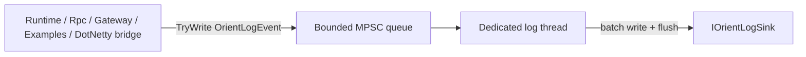

# Design: Orient Logging

Date: 2026-07-19  
Status: Approved for planning  
Scope: Replace diagnostic `Console.WriteLine` / `Console.Error.WriteLine` with a project-owned logging subsystem

## Goal

Introduce a lightweight, project-owned logging stack so that:

1. Framework and example diagnostic output no longer depends on ad-hoc `Console.WriteLine`.
2. Producers on executor / DotNetty IO / ThreadPool threads never perform sink I/O.
3. Call sites remain simple: category + level + message; each event automatically records `ManagedThreadId`.
4. Hosts that do not configure logging stay silent by default.

This addresses [architecture.md §8.6](../../../Doc/architecture.md) and [§10 item 4](../../../Doc/architecture.md).

## Non-goals

- Do **not** use `Microsoft.Extensions.Logging` (Abstractions, Console, or other providers).
- Do **not** require explicit `[executor|io|tp|host]` tags at call sites; `ThreadId` is sufficient.
- Do **not** build metrics, tracing, or a general observability bus in this change.
- Do **not** replace non-logging Console usage: `Console.CancelKeyPress`, `Console.ReadKey`, protoc-plugin stdin/stdout protocol.
- Do **not** change `Tests/Orient.Tests/ConsoleTestOutput.cs` beyond what tests need after producers stop writing Console directly.
- Do **not** implement multi-threaded log consumers, sampling, or extreme zero-allocation sinks in v1.

## Decisions

| Topic | Decision |
| --- | --- |
| API stack | New `Orient.Logging` project; custom `IOrientLogger` / `IOrientLoggerFactory` |
| Default behavior | `NullOrientLoggerFactory` when unset; no Console side effects from core libraries |
| Consumer | One dedicated logging thread per `OrientLogService` |
| Queue | Bounded MPSC; `TryWrite` never blocks producers |
| Overload | Drop events when full; count drops; consumer periodically emits a drop summary |
| Thread identity | Auto-capture `Environment.CurrentManagedThreadId` on every event |
| DotNetty | Bridge via `InternalLoggerFactory.DefaultFactory`; pipeline `LoggingHandler` off by default |
| Package cleanup | Remove unused `Microsoft.Extensions.Logging.Console` from `Orient.Rpc` |
| Project references | `Orient.Runtime` → `Orient.Logging`; `Orient.Rpc` → Runtime + Logging + DotNetty; `Orient.Logging` depends only on BCL |

## Architecture



- Producers only enqueue; they never write Console/files.
- One consumer thread drains the queue in batches and writes the configured sink.
- One process binds at most one active DotNetty `InternalLoggerFactory` bridge to one host `OrientLogService` (DotNetty factory is process-global).

## Components

New project: `Orient.Logging`.

Project reference graph:

```text
Orient.Logging          (BCL only)
      ↑
Orient.Runtime
      ↑
 Orient.Rpc             (+ DotNetty; owns DotNetty log bridge)
      ↑
Examples / GateWay
```

`Orient.Logging` must not reference Runtime, Rpc, or DotNetty.

| Type | Responsibility |
| --- | --- |
| `OrientLogLevel` | Trace, Debug, Info, Warn, Error, Fatal |
| `OrientLogEvent` | Immutable payload: timestamp, level, eventId, category, managedThreadId, message, optional exception |
| `IOrientLogger` | Frontend used by call sites; checks level before formatting |
| `IOrientLoggerFactory` | Creates category loggers; default Null |
| `OrientLogService` | Owns bounded queue, dedicated consumer thread, and sink lifecycle |
| `IOrientLogSink` | `Write(batch)` + `Flush`; implementations must tolerate being called only from the log thread |
| `ConsoleOrientLogSink` | Example/default host sink; formats timestamp, level, thread id, category, message |
| `NullOrientLogger` / `NullOrientLoggerFactory` | Silent defaults |

DotNetty bridge types (`OrientInternalLoggerFactory` / `OrientInternalLogger`) live in **`Orient.Rpc`** (or a small Rpc-side adapter), not in `Orient.Logging`, so the logging core stays free of DotNetty dependencies. They forward into the host's shared `OrientLogService` queue.

### Injection points

- `OrientExecutorOptions` accepts optional `IOrientLoggerFactory` (or a single logger for the executor category).
- `CRpcServerOptions` / `CRpcClientOptions` accept optional `IOrientLoggerFactory`.
- Example and Gateway `Program` create one `OrientLogService` + `ConsoleOrientLogSink`, pass the factory into components, and dispose/stop the service on shutdown.
- Components that currently construct nested objects (for example `TcpChannelHost`) receive logger/factory from their owner options rather than creating a second log service.

### Event fields

Minimum fields on `OrientLogEvent`:

- `Timestamp` — captured at produce time (not at flush time)
- `Level`
- `EventId` — stable integer for important framework events (timeout, decode failure, etc.)
- `Category` — type or subsystem name, e.g. `Orient.Rpc.Client.CRpcClient`
- `ManagedThreadId` — `Environment.CurrentManagedThreadId`
- `Message` — final formatted string
- `Exception` — optional; pass the exception object, do not stringify into `Message`

Optional later (not required for v1): executor name/id as a separate field if useful for multi-executor demos.

## Call-site conventions

- Prefer `logger.Warn(...)` / `logger.Error(...)` for failures; demote noisy debug lines (`*********CallAsync send`) to Trace or delete them.
- Keep programmatic error channels: `OrientExecutor.UnhandledException`, `CRpcClient.OnPushException`, etc. Hosts may subscribe and log; core still must not require a configured logger to stay correct.
- Message formatting v1: use a custom interpolated-string handler (or equivalent) so disabled levels avoid string allocation.
- Do not guess “logical role” of the thread; category + `ThreadId` are the correlation tools.

### Example sink line shape

```text
2026-07-19 15:26:10.123 [WARN] [T:12] Orient.Rpc.Client.CRpcClient RPC call timed out
```

## DotNetty integration

1. At host startup, before creating channels/bootstraps, set `InternalLoggerFactory.DefaultFactory` to the Orient bridge bound to the host `OrientLogService`.
2. Map DotNetty Trace/Debug/Info/Warn/Error onto `OrientLogLevel`; preserve DotNetty logger names as categories.
3. `TcpChannelHost` currently always adds `LoggingHandler`. Change to:
   - `ChannelLoggingEnabled` default `false`
   - when enabled, keep using DotNetty `LoggingHandler` so output flows through the same factory bridge
   - default configuration must not dump RPC payloads; prefer event metadata only. If stock `LoggingHandler` cannot avoid payload dumps safely, replace with an Orient-owned channel handler that logs safe summaries only.
4. Bridge writes must use non-blocking `TryWrite`; never block DotNetty event-loop threads on sink I/O.

## Performance

Primary goal: logging must not stall business or IO threads.

1. **Hot path when disabled**: level check returns immediately; no message allocation.
2. **Hot path when enabled**: build event + `TryWrite`; no Console/file I/O on the producer thread.
3. **Bounded queue**: fixed capacity; on full, drop and increment counters; producers never wait.
4. **Error retention (optional)**: a small reserved capacity for Error/Fatal is allowed, still non-blocking; if even that is full, drop.
5. **Consumer batching**: log thread drains in batches and flushes on batch boundary / idle timeout, not necessarily after every line.
6. **Drop visibility**: consumer emits periodic `dropped N since last report` summaries so overload is observable.
7. **Default production levels**: Info or Warn for hosts; Trace/Debug off so per-RPC chat stays off.
8. **v1 YAGNI**: no multi-consumer sharding, no lock-free ring-buffer micro-optimizations, no pooled event objects required for first cut (may add later if GC pressure shows up).

Correctness of RPC/runtime must not depend on a log line being written successfully.

## Lifecycle and error handling

- Host creates `OrientLogService`, starts the consumer thread, and owns shutdown.
- Shutdown sequence: stop accepting → drain queue → flush sink → stop thread → dispose sink.
- Sink or consumer exceptions are isolated: count/report them; never callback into a business `OrientExecutor`.
- Process abort / hard crash is best-effort only.
- When no factory is configured, Runtime/Rpc use Null loggers. Existing stderr fallbacks in `OrientExecutor` / Host / Runner should move to logger calls; if Null, those lines disappear unless the host subscribes `UnhandledException` (or configures logging). Document this behavior change for operators.

## Migration scope

### In scope

- `Orient.Runtime`: executor unhandled-exception and host/runner Tick catch paths
- `Orient.Rpc`: `CRpcClient`, `CRpcServer`, `CRpcServerHandler`, decoder, write-buffer warning, related diagnostics
- `Example/GateWay/GateWay.Core` and Example `Program` / client display logs
- DotNetty internal logger bridge + optional channel logging option
- Update `Doc/architecture.md` §8.6 and §10 item 4 to match this design (ThreadId, not source tags)
- Remove unused MEL Console package reference from `Orient.Rpc`

### Out of scope / leave alone

- `Tool/orient-crpc-plugin` stdin/stdout protocol
- Interactive Console APIs used for Ctrl+C and “press any key”
- Building a file-rotation sink in v1 (interface must allow adding one later)

## Testing

- Queue: enqueue, bounded drop, drop counters, orderly shutdown drain
- Level filtering: disabled level does not enqueue / does not allocate message when using the handler path
- `ManagedThreadId` captured from producer thread, not consumer thread
- Fake sink: assert writes occur only on the log consumer thread
- DotNetty bridge: level mapping and enqueue behavior
- Integration smoke: HelloWorld / GateWay with Console sink still show startup and call results when configured

## Documentation updates

After implementation (or as part of the same change set as the logging feature):

- Rewrite §8.6: Console is not the observability path; use `Orient.Logging` and record `ThreadId`.
- Rewrite §10 item 4: “Introduce Orient.Logging; replace diagnostic Console writes; record thread id.”
- Spec location: this file under `docs/superpowers/specs/`.

## Open implementation details (left to the plan)

These do not reopen architecture questions; they are sequenced in the implementation plan:

- Exact queue capacity and batch size defaults
- Exact `EventId` catalog for framework events
- Whether `OrientLogEvent` is a class or struct in v1
- Precise option property names on server/client/host options
- Whether unconfigured Runtime unhandled/Tick-escape paths keep a stderr last-resort fallback, or become fully silent under Null
- How drop-summary lines are emitted when the queue is full (prefer: log thread writes summary directly to sink, bypassing the queue)
- Test isolation strategy for process-global `InternalLoggerFactory.DefaultFactory`
